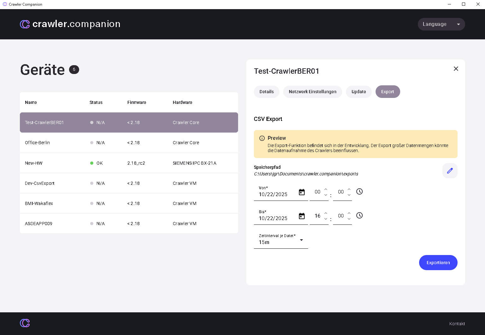

## **Data Export (CSV Files)**

- **Secure and analyze data:** The customer can export specific device data. This is particularly useful for: 
  - **Backup:** Backing up the current device configuration.
  - **Analysis:** Exporting measurement data or log information for further processing.
- **Choose export format:** The software offers the option to export data in the standardized CSV format (Comma Separated Values – suitable for spreadsheets).
- **Set export destination:** The customer selects the storage location on their PC where the export file should be saved.

