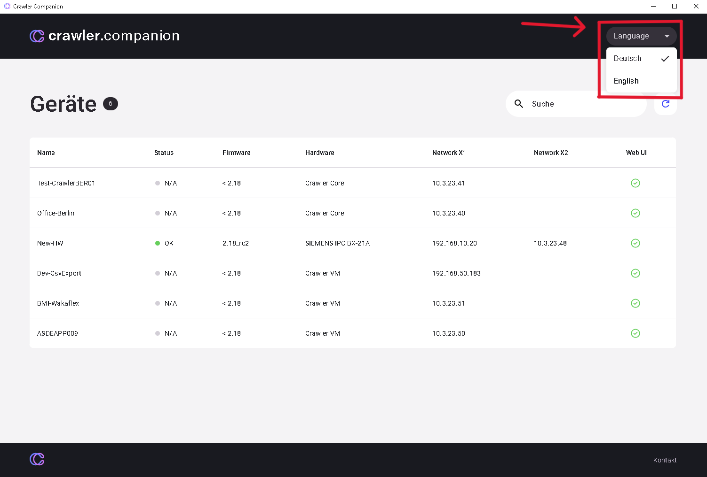

### **Change Language Settings**

- **Adjust language:** Via a settings menu, the customer can easily switch the display language of the Crawler.Companion software.
- **Make selection:** The interface shows a list of available languages (in the example German and English). The customer selects the desired language from the list and confirms the selection. The application then switches accordingly.

