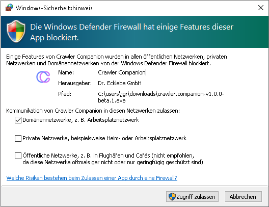
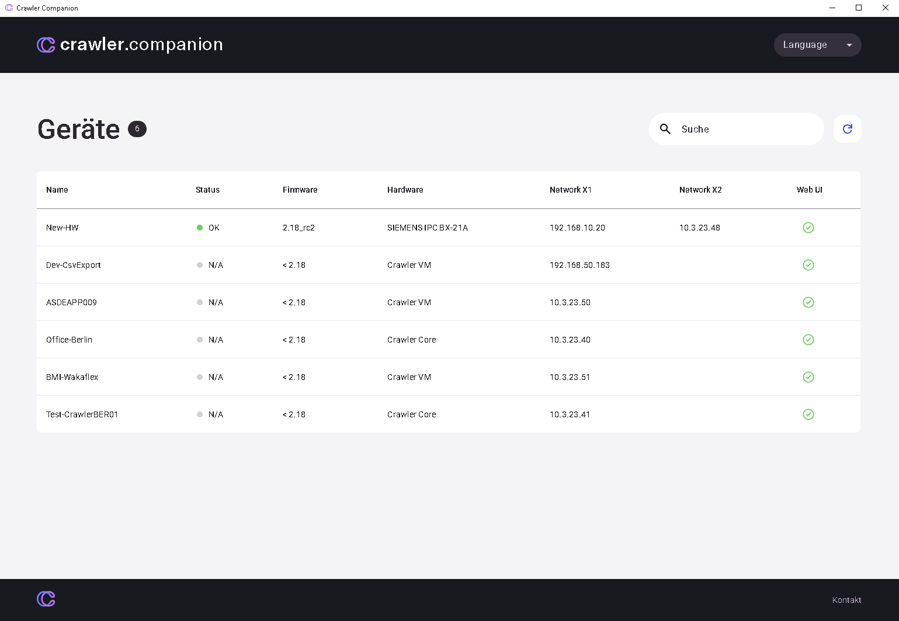
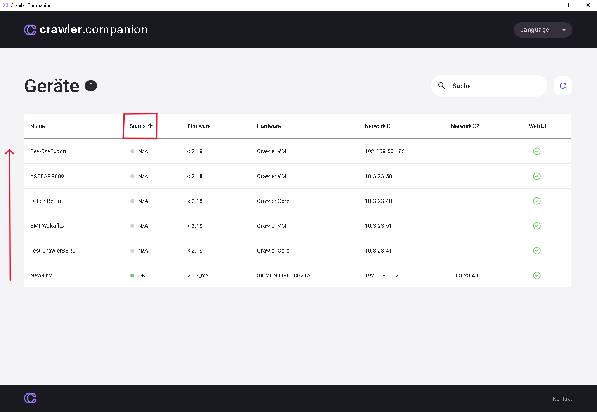
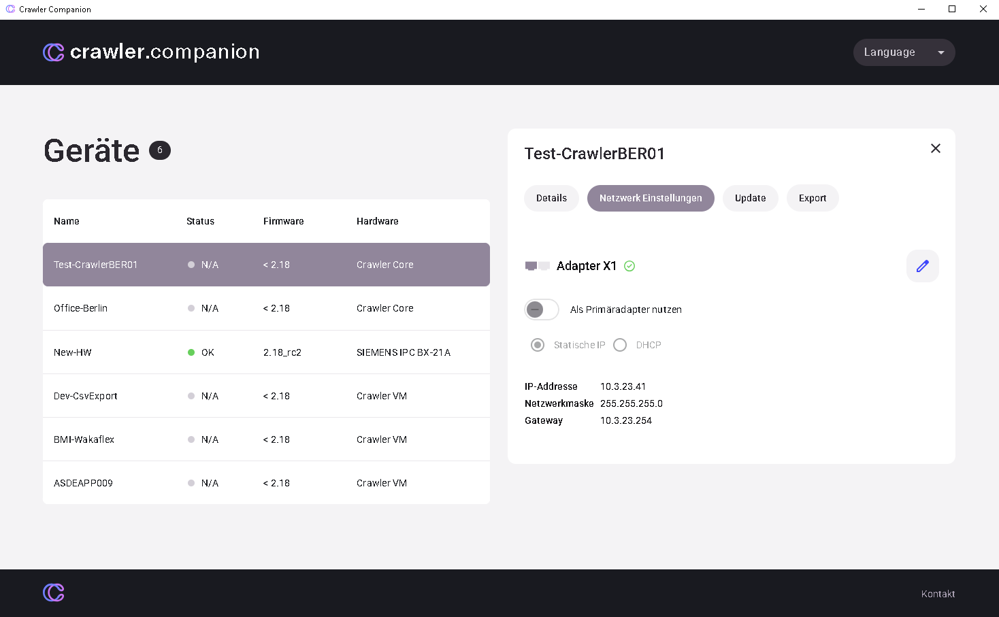
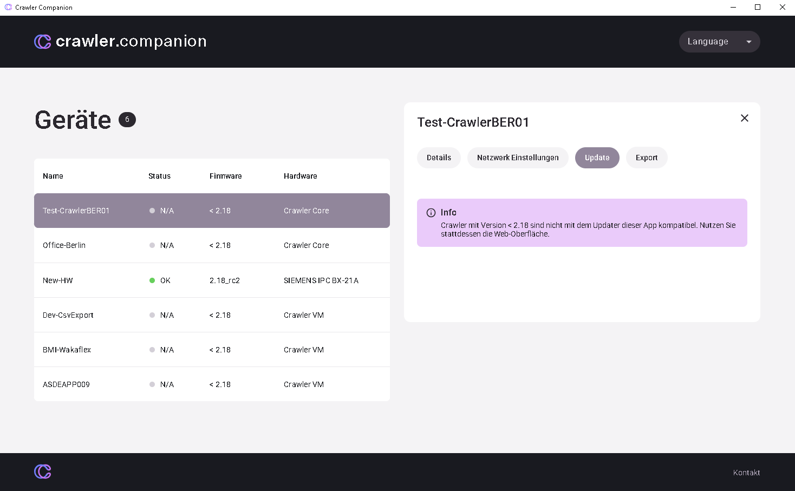
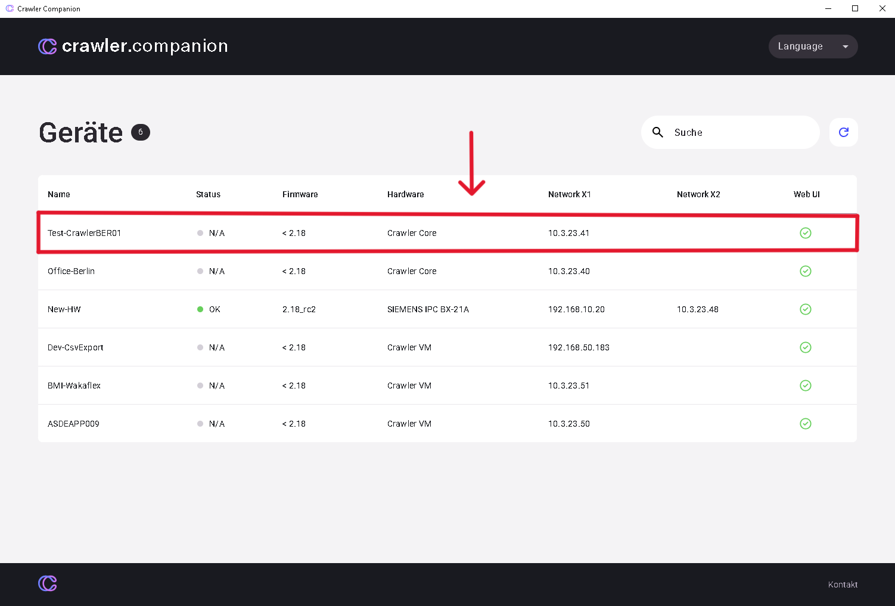
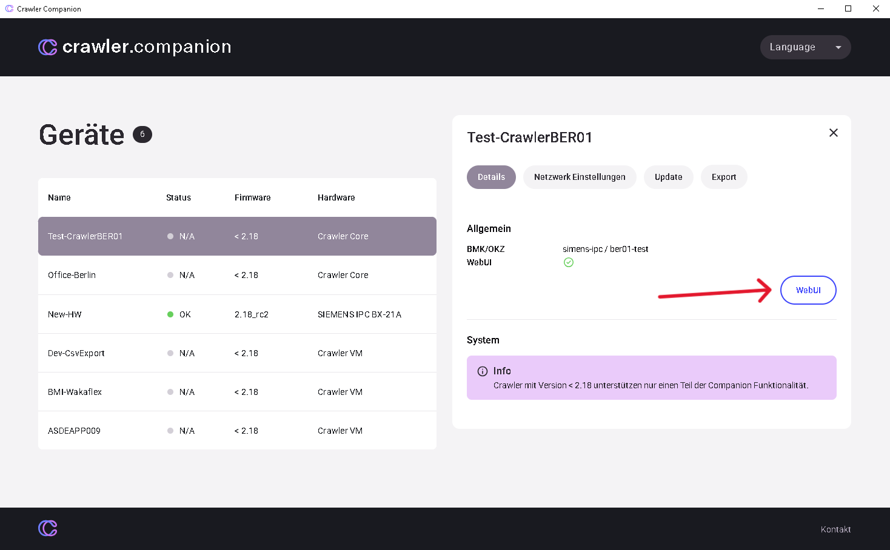

## Installation & Inbetriebnahme

**Installation und Inbetriebnahme:** Die Installation des Crawler.Companion ist ein unkomplizierter Vorgang:

## A. Vorbereitung

1. **Installationsdatei herunterladen:** Laden Sie die aktuelle Installationsdatei (Edge (Crawler)CompanionSetup.exe oder ähnlich) von der offiziellen Download-Seite oder von Ihrem technischen Ansprechpartner herunter.

2. **Administratorrechte:** Stellen Sie sicher, dass Sie die erforderlichen Administratorrechte für das Zielsystem besitzen.

3. **Netzwerkverbindung:** Verbinden Sie den PC, auf dem der Companion installiert werden soll, mit demselben LAN-Segment (lokales Netzwerk), in dem sich die Edge (Crawler)-Geräte befinden.

## B. Startvorgang

1. **Installation starten:** Doppelklicken Sie auf die heruntergeladene Datei (Edge (Crawler)CompanionSetup.exe).

2. **Sicherheitsabfrage:** Bestätigen Sie die Windows-Sicherheitsabfrage, um die Ausführung als Administrator zu erlauben.

3. 

3. **Lizenzvereinbarung (EULA):** Lesen Sie den Endbenutzer-Lizenzvertrag und akzeptieren Sie ihn, um fortzufahren.

---

## Technische Spezifikationen und Systemanforderungen

**Technische Spezifikationen und Systemanforderungen:** Um einen reibungslosen Betrieb des Crawler.Companion sicherzustellen, müssen die folgenden Mindestanforderungen an das verwendete System erfüllt sein:

| Kategorie                   | Mindestanforderung                                                        | Empfohlen            |
| --------------------------- | ------------------------------------------------------------------------- | -------------------- |
| Betriebssystem (OS)         | Windows 10 (64-Bit)                                                       | Windows 11 (64-Bit)  |
| Prozessor (CPU)             |                                                                           |                      |
| Arbeitsspeicher (RAM)       |                                                                           |                      |
| Festplattenspeicher         |                                                                           |                      |
| Netzwerk                    |                                                                           |                      |
| Erforderliche Programme     | WebView2 wird unter Windows 10 SAC 1709 und neueren Versionen unterstützt. | Standardmäßig unterstützt |

# **Software-Voraussetzungen:**

- Der Benutzer benötigt möglicherweise lokale Administratorrechte für die Installation und für bestimmte Funktionen, die den Netzwerkverkehr beeinflussen (z. B. Geräteerkennung).
- Die Firewall muss so konfiguriert sein, dass der Companion über den erforderlichen Discovery-Port kommunizieren kann (standardmäßig ein UDP-Port).

---

## Ersteinrichtung – Schritt für Schritt

## **1) Companion starten**

- Öffnen Sie die Companion-Datei (keine Installation erforderlich). In der Regel handelt es sich um eine ausführbare Datei (.exe unter Windows, .app/.dmg unter macOS oder eine ausführbare Binärdatei).
- Falls Sie dazu aufgefordert werden: Erlauben Sie die Anwendung (z. B. Bestätigen Sie die Sicherheitsabfrage des Betriebssystems).

:::tip
**Erwartetes Ergebnis** Das Companion-Fenster öffnet sich und zeigt die Benutzeroberfläche an.
:::

:::danger
**Fehlerbehebung**

- Falls die App nicht startet: Rechtsklick → „Als Administrator ausführen" (Windows) oder Start in den macOS-Einstellungen unter „Sicherheit & Datenschutz" erlauben.
- Prüfen Sie, ob Antivirus/SmartScreen die Datei blockiert.
:::

---
## **2) Netzwerk prüfen / IP-Bereich einstellen**

- Prüfen Sie, in welches Subnetz das Gerät standardmäßig sendet:
  - **X1:** Geräte senden typischerweise im Bereich 192.168.0.x
  - **X2:** Geräte senden typischerweise im Bereich 192.168.1.x
- Stellen Sie die IP Ihres PCs vorübergehend so ein, dass sie sich im selben Subnetz befindet (z. B. 192.168.0.10 für X1 oder 192.168.1.10 für X2).

### **Windows**

- Einstellungen → Netzwerk & Internet → Adapteroptionen ändern.
- Rechtsklick auf den aktiven Adapter → Eigenschaften → Internetprotokoll Version 4 (TCP/IPv4) → Eigenschaften.
- Wählen Sie „Folgende IP-Adresse verwenden" und geben Sie z. B. IP 192.168.0.10, Subnetzmaske 255.255.255.0, Gateway leer oder 192.168.0.1 ein.

### **MacOS**

- Systemeinstellungen → Netzwerk → Adapter auswählen → „Erweitert" → TCP/IP.
- Konfigurieren: „Manuell" → IP 192.168.0.10, Subnetzmaske 255.255.255.0.

:::tip
**Erwartetes Ergebnis** Ihr PC hat eine IP im entsprechenden Subnetz und kann Broadcast-Pakete an Geräte im selben Subnetz empfangen.
:::

:::note
**Fehlerbehebung**

- Notieren Sie sich vorab Ihre normale Netzwerkkonfiguration, damit Sie sie später wiederherstellen können.
- Wenn Ihr PC über ein Firmen-VPN oder eine spezielle Firewall verbunden ist, deaktivieren Sie das VPN oder verwenden Sie ein isoliertes LAN (z. B. per Ethernet direkt an einen Switch).
:::

---
## **3) Nach Geräten suchen (Broadcast)**

- Im Companion: Klicken Sie auf „Suchen" (Lupensymbol).
- Die Software sendet Broadcast-/Discovery-Anfragen und listet alle gefundenen Edge (Crawler) im lokalen Broadcast-Bereich auf.

:::tip
**Erwartetes Ergebnis** Alle erreichbaren Edge (Crawler) erscheinen in der Geräteliste mit Informationen wie Seriennummer, Modell, aktueller IP (falls verfügbar) und Status.
:::

:::danger
**Fehlerbehebung** Falls keine Geräte erscheinen:

- Prüfen Sie die Netzwerkeinstellungen erneut (Schritt 2).
- Deaktivieren Sie vorübergehend die Firewall auf dem PC oder fügen Sie den Companion zu den Ausnahmen hinzu.
- Starten Sie das Gerät neu (Werkseinstellungen ausschließen).
- Prüfen Sie, ob sich der PC physisch im selben Netzwerk/Segment wie das Gerät befindet (kein WLAN/Gastnetzwerk mit Isolation).
:::

---
## **4) Gerät auswählen / Details öffnen**

- Klicken Sie einmal auf die Zeile des gewünschten Edge (Crawler)s in der Liste.
- Das anklickbare Element öffnet die Detailansicht oder die Netzwerkeinstellungen des Geräts.

:::tip
**Erwartetes Ergebnis** Sie sehen Details: aktuelle IP (falls verfügbar), MAC, Netzwerkmodus (DHCP/statisch), ggf. Hostname sowie Schaltflächen für Aktionen (z. B. IP ändern, Web-UI, Neustart).
:::

:::danger
**Fehlerbehebung**

- Falls die Detailansicht leer bleibt: Versuchen Sie Doppelklick oder Rechtsklick → „Details".
- Falls mehrere identische Geräte erscheinen, orientieren Sie sich an MAC oder Seriennummer.
:::

---
## **5) IP anpassen (statisch vs. DHCP) und Änderungen speichern**

- Wählen Sie in den Netzwerkeinstellungen des Geräts:
  - **DHCP**, wenn das Gerät eine IP automatisch vom Router beziehen soll (empfohlen, wenn ein DHCP-Server im Netzwerk vorhanden ist).
  - **Statische IP**, wenn Sie eine feste Adresse vergeben möchten (z. B. 192.168.0.50).
- Geben Sie bei statischer IP ein: IP, Subnetzmaske (255.255.255.0), ggf. Gateway und DNS.
- Klicken Sie auf Speichern / Übernehmen.

:::tip
**Erwartetes Ergebnis**

- Der Companion bestätigt die Änderung. Das Gerät führt möglicherweise einen Neustart durch und ist anschließend unter der neuen IP erreichbar.
:::

:::note
**Praxisbeispiele**

- Gerät X1 statisch: IP=192.168.0.50, Subnetz 255.255.255.0.
- Gerät X2 statisch: IP=192.168.1.50, Subnetz 255.255.255.0.
:::

:::danger
**Fehlerbehebung**

- Gerät startet neu, ist aber nicht erreichbar: Prüfen Sie, ob sich der PC wieder im selben Subnetz befindet.
- Achten Sie beim Festlegen einer statischen IP auf IP-Konflikte (kein anderes Gerät darf dieselbe IP haben).
- Verwenden Sie ping \<IP> oder arp -a (Windows/macOS), um zu prüfen, ob das Gerät antwortet.
:::

---
## **6) Web-UI aufrufen**

- Im Companion: Klicken Sie auf Web-UI (oder öffnen Sie manuell im Browser http\://\<neue-IP> — z. B. http\://192.168.0.50).
- Warten Sie, bis die Web-Oberfläche geladen ist. Möglicherweise ist eine Anmeldung erforderlich.

:::tip
**Erwartetes Ergebnis** Der Browser zeigt die Web-UI des Edge (Crawler)s an (Status, Protokolle, Konfiguration).
:::

:::danger
**Fehlerbehebung**

- Der Browser warnt vor einer unsicheren Verbindung (HTTP oder selbstsigniertes Zertifikat) — erlauben Sie eine Sicherheitsausnahme, wenn das Gerät intern ist.
- Falls die Seite nicht lädt:
  - Stellen Sie sicher, dass keine Proxy-Einstellungen stören.
  - Überprüfen Sie die Firewallregeln auf dem PC.
  - Versuchen Sie einen anderen Browser oder curl http\://\<IP> in einem Terminal.
  - Falls HTTPS erwartet wird, versuchen Sie https\://\<IP> (und akzeptieren Sie ggf. die Zertifikatsausnahme).
:::

---
## **Zusatz: PC-Netzwerkkonfiguration prüfen und zurücksetzen**

- Setzen Sie nach abgeschlossener Konfiguration die PC-Netzwerkeinstellungen auf den ursprünglichen Zustand zurück (z. B. DHCP), sofern Sie sie vorübergehend geändert haben.
- Prüfen Sie die Erreichbarkeit aus dem normalen Unternehmensnetzwerk (falls das Gerät dort dauerhaft betrieben werden soll): ggf. Gerät mit dem Zielnetzwerk verbinden oder DNS/Firewall anpassen.

### **Testbefehle**

- Windows: ping 192.168.0.50
- macOS / Linux: ping -c 4 192.168.0.50
- ARP-Cache anzeigen: arp -a

## **Kurzübersicht / Checkliste**

1. Companion starten.

2. PC-IP auf 192.168.0.x (X1) oder 192.168.1.x (X2) einstellen.

3. Im Companion auf „Suchen" klicken.

4. Gewünschtes Gerät in der Liste anklicken → Details öffnen.

5. IP-Modus wählen (DHCP oder statisch) → Speichern → Gerät neu starten.

6. Web-UI über die Schaltfläche oder http\://\<neue-IP> im Browser öffnen.

7. PC-Netzwerk zurücksetzen und Erreichbarkeit prüfen.

---

## Gerätefunktionen – Übersicht

## **Geräteübersicht und Filterfunktionen**

In der Hauptansicht sehen Sie eine Tabelle aller erkannten Geräte.

- **Filter:** Um Geräte gezielt zu finden, können Sie die integrierten Filterfunktionen verwenden.
  - Über die Filtereinstellungen können Sie die Anzeige nach verschiedenen Kriterien einschränken (z. B. nach Softwareversion, Status oder Gerätename).

---
## **Geräte bearbeiten (Details)**

Durch Auswahl eines Geräts und Klick auf die Detailansicht (oder eine entsprechende „Bearbeiten"-Funktion) erhalten Sie Zugriff auf folgende Verwaltungsoptionen:

- **Allgemeine Eigenschaften:** Im Detailfenster können Sie grundlegende Geräteeigenschaften einsehen und ggf. bearbeiten. Dazu kann auch die Änderung des Gerätenamens oder anderer gerätespezifischer Einstellungen gehören.

---
## **Netzwerkeinstellungen ändern**

So passen Sie die IP-Adresse oder andere Netzwerkeinstellungen eines Geräts an:

1. Wählen Sie das Gerät in der Übersicht aus.

2. Navigieren Sie zum Bereich **Netzwerkeinstellungen**.

2. 

3. Wählen Sie zwischen **DHCP** (automatische Adresszuweisung durch das Netzwerk) oder **Statische IP** (feste, manuell zugewiesene Adresse).

4. Geben Sie bei statischer IP die neue IP-Adresse, Subnetzmaske und Gateway ein.

5. Speichern Sie die Änderungen. Das Gerät übernimmt die neuen Einstellungen und ist anschließend unter der neuen Adresse erreichbar.

---
## **Software-Update**

So aktualisieren Sie die Software (Firmware/OS) eines Edge-Geräts:

1. Wählen Sie das Gerät aus und navigieren Sie zur Update-Funktion.

   

2. Die Software zeigt Ihnen die aktuell installierte Version und verfügbare neuere Versionen an.

3. Wählen Sie die gewünschte Version aus.

4. Starten Sie den Update-Vorgang. Das Gerät lädt das Update herunter und installiert es.

   **ACHTUNG:** Der Update-Vorgang kann mehrere Minuten dauern. Starten Sie das Gerät in dieser Zeit nicht neu.

---
## **Datenexport (CSV-Dateien)**

So exportieren Sie spezifische Daten (z. B. Konfigurations-Backups oder Protokolle) als CSV-Datei:

1. Wählen Sie das Gerät aus und navigieren Sie zur Export-Funktion.

1. 

2. Wählen Sie den Typ der zu exportierenden Daten (z. B. Konfiguration, Messdaten-Metadaten usw.).

3. Starten Sie den Export. Die Daten werden im CSV-Format (Comma Separated Values, ein einfaches Textformat zur Speicherung tabellarischer Daten) auf Ihrem lokalen Computer gespeichert.

---
## **Zugriff auf die WebUI**

Sie können direkt über den Crawler.Companion auf die Web-Oberfläche des Edge-Geräts zugreifen:

1. Wählen Sie das Gerät aus.

1. 

2. Suchen Sie nach der Schaltfläche „Zur WebUI" oder einem ähnlichen Symbol (häufig ein Browser-Symbol).

2. 

3. Ihr Standard-Webbrowser öffnet sich und stellt eine Verbindung zur IP-Adresse des ausgewählten Geräts her.
