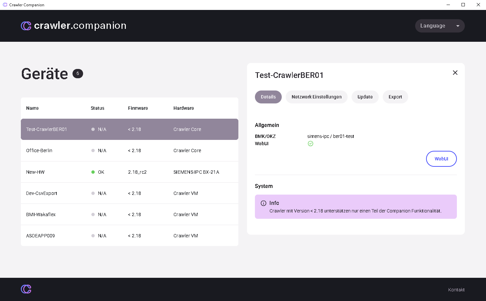

:::note
This page has not been translated yet. Content is shown in English.
:::

## **View and Edit Device Details**

After clicking on a device, the "Details" tab opens:

| Field         | Meaning                                                    |
| ------------- | ---------------------------------------------------------- |
| Name          | Name of the device                                         |
| Status        | Status                                                     |
| WebUI         | Link to the web interface of the Crawler                   |
| Firmware      | Currently installed version (e.g., ≤2.18) and last update. |
| MAC 1/2       | Read-out addresses (X1 / X2).                              |
| Serial Number | Read out when available.                                   |

- **Check technical details:** After selecting a device, the customer can view all relevant technical data that goes beyond the standard overview. This may include internal serial numbers, hardware type, or specific configuration IDs.
- **Edit device name (option):** In this view, the customer has the option to change the device name on the network to simplify identification. They enter the new name and save the change.

