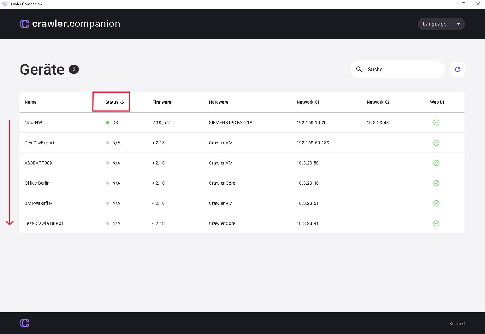

:::note
This page has not been translated yet. Content is shown in English.
:::

## **Search**

What the customer can do:

- **Targeted search:** With many devices, the customer can use the search and filter functions to reduce the device list to relevant entries.

## **Filter**

- **Filter by criteria:** The customer can filter devices by various criteria, such as device status (e.g., display only "Online" devices) or software version.
- **Adjust filtered view:** The filter dialog allows entering specific values (e.g., only devices with software version "V1.0.0.1") to precisely adjust the display.
- **Apply filter:** After selecting the criteria, the customer applies the filter to display only matching devices in the main table.

