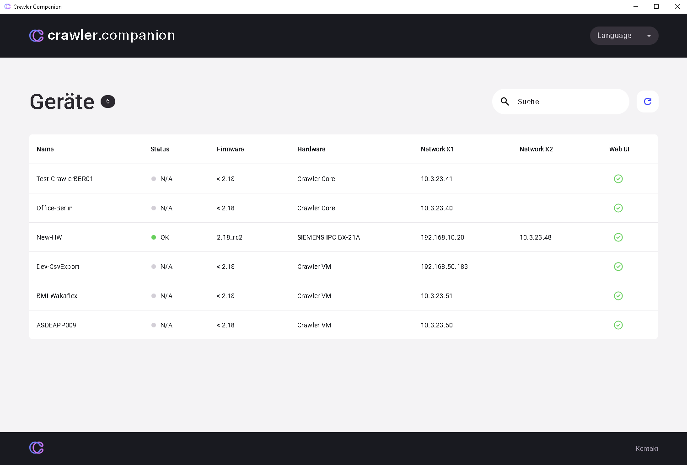

Die Crawler.Companion-Software ist ein intuitives Werkzeug, das die lokale Verwaltung Ihrer Edge (Crawler)-Geräte erleichtert. Nachfolgend finden Sie eine Beschreibung der Hauptfunktionen anhand der Benutzeroberfläche der Anwendung.

# **Oberflächen-Übersicht und Geräteerkennung**

- **Geräte sofort finden:** Nach dem Start der Anwendung werden alle im lokalen Netzwerk gefundenen Edge (Crawler)-Geräte automatisch in der zentralen Tabelle aufgelistet.
- **Wichtige Daten einsehen:** Der Anwender erhält auf einen Blick eine Übersicht der wichtigsten Gerätedaten wie Gerätename, aktuelle IP-Adresse, Status (z. B. „Online") und installierte Softwareversion.
- **Geräte auswählen:** Durch Klick auf ein Gerät in der Liste kann der Anwender es auswählen und über die rechte Seite der Oberfläche auf alle spezifischen Verwaltungsfunktionen zugreifen (Details, Netzwerk, Update, Export).

