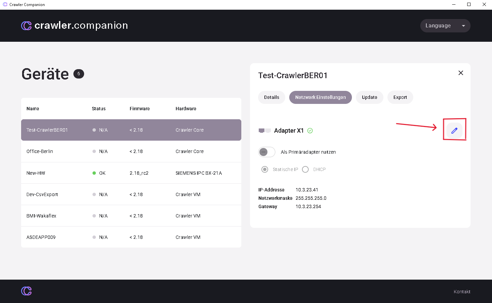
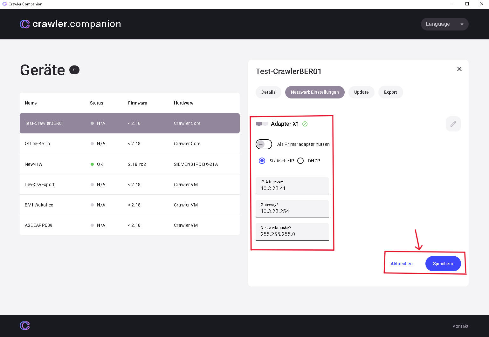

### **Reiter „Netzwerk"**

- **Kontrollkästchen „Als primären Adapter verwenden"** → Bestimmt, über welchen Port der Companion antwortet.
- **Konfigurationsmodus**
  - **DHCP:** Gerät bezieht IP automatisch.
  - **Statisch:** IP, Netzmaske und Gateway können frei eingegeben werden.
- **DNS-Server** optional.
- **Speichern** → Gerät startet mit neuen Werten neu.

- **IP-Modus festlegen:** Der Anwender kann bestimmen, wie das Gerät seine IP-Adresse bezieht:
  - **DHCP:** Die Adresse wird automatisch vom Netzwerk zugewiesen.
  - **Statische IP:** Der Anwender kann eine feste, manuelle Adresse vergeben.
- **Statische Adressen vergeben:** Wenn der Anwender „Statische IP" wählt, können die erforderlichen Parameter selbst eingegeben werden:
  - **IP-Adresse** (Eindeutige Netzwerkadresse)
  - **Subnetzmaske** (Bestimmt den Adressbereich des lokalen Netzwerks)
  - **Gateway** (Router-Adresse für die Kommunikation außerhalb des lokalen Netzwerks)
- **Konfiguration übernehmen:** Nach der Dateneingabe speichert der Anwender die Einstellungen. Das Gerät übernimmt die neuen Einstellungen, was für eine dauerhafte Erreichbarkeit wichtig ist.

