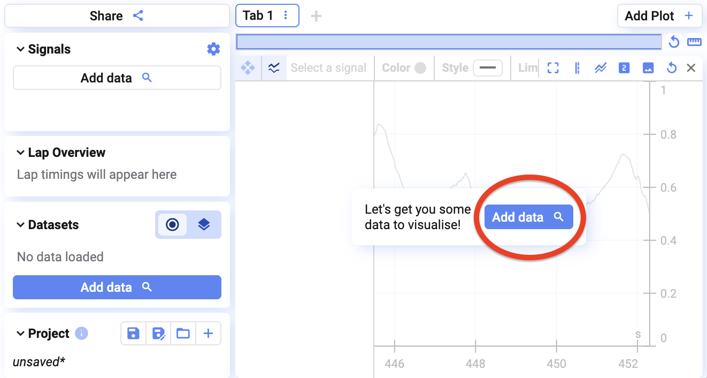
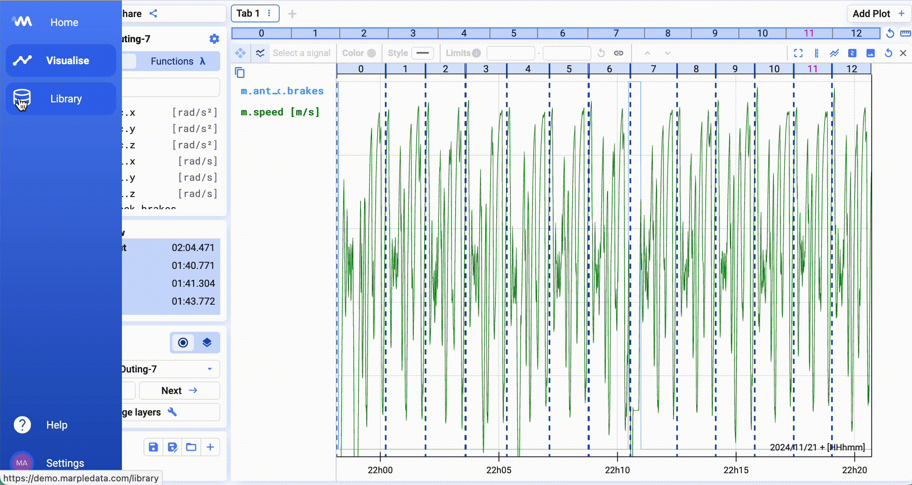
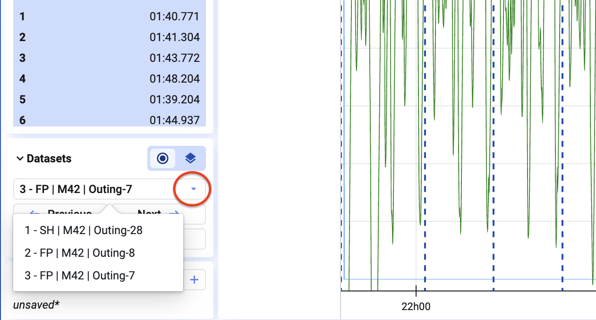
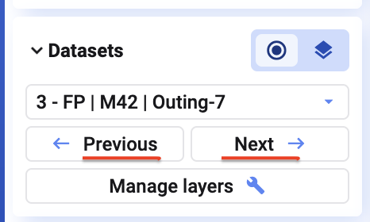
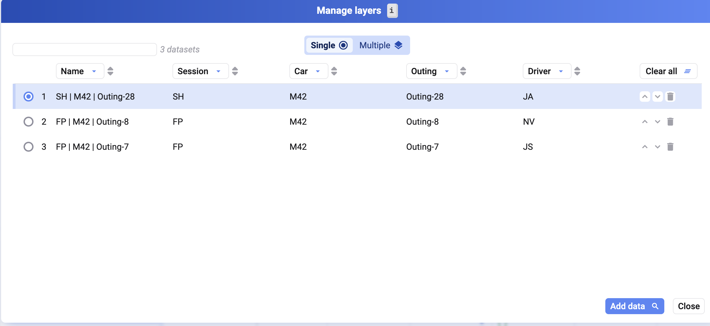

## Daten in ein leeres Projekt laden

Klickt auf **Add data** und sucht dann die gewünschten Daten in der Datenbibliothek — siehe [Selecting Data](/de/deepview/database#selecting-data).

## Weitere Daten zu einem bestehenden Projekt hinzufügen

1. Geht zur Datenbibliothek
2. Sucht und wählt die gewünschten Daten aus
3. Klickt unten rechts auf **Visualise**

## Zwischen geladenen Datensätzen wechseln

Unten links zeigt der Bildschirm, welcher Datensatz aktuell geladen ist. Über das Dropdown wechselt ihr zu einem anderen, alternativ über die Pfeile links/rechts im selben Bereich.

Mit <kbd>i</kbd> (oder Klick auf **Manage layers**) öffnet sich der Dialog **Manage layers**. Dort könnt ihr:

1. Auswählen, welcher geladene Datensatz visualisiert wird
2. Die Reihenfolge der Datensätze ändern
3. Weitere Daten hinzufügen
4. Einen geladenen Datensatz entfernen

## Einen Datensatz entfernen

Klickt im Dialog **Manage layers** auf das Papierkorb-Symbol neben einem Datensatz, um ihn aus dem Project zu entfernen.

