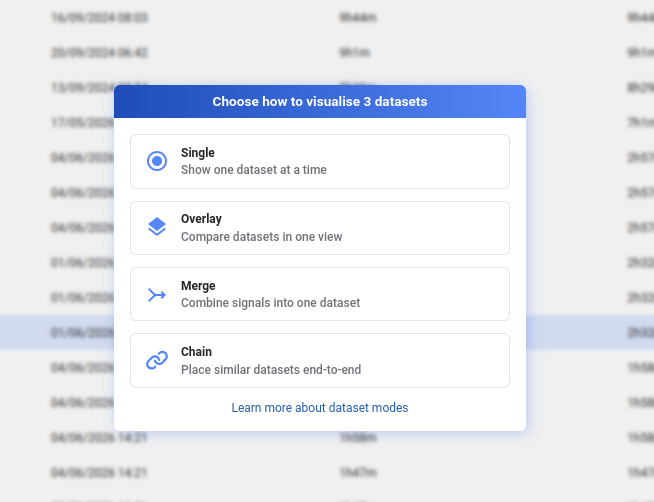
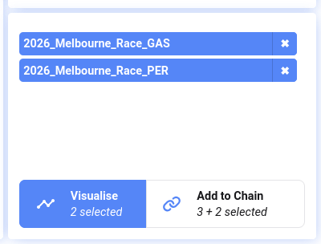
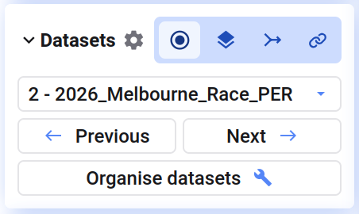

Wenn ihr mehr als einen Datensatz in einem Projekt visualisiert, legt ihr fest, wie diese Datensätze zusammenspielen — der **Dataset Mode**. Ihr wählt einen Modus beim Visualisieren mehrerer Datensätze aus der Bibliothek und könnt ihn jederzeit unten links auf der Analyseseite ändern.

- **Single** — jeweils einen Datensatz anzeigen und zwischen ihnen wechseln
- **Overlay** — mehrere Datensätze übereinander in denselben Plots darstellen, um sie zu vergleichen
- **Merge** — Signale mehrerer Datensätze zu einem zusammenführen
- **Chain** — mehrere Datensätze auf der Zeitachse hintereinander anordnen, sodass eine durchgängige Aufzeichnung entsteht

Wenn bereits Daten geladen sind, könnt ihr neu ausgewählte Datensätze anhängen und im selben Modus fortfahren, oder eine neue Sitzung nur mit den neu ausgewählten Datensätzen in einem anderen Modus starten.

## Dataset Mode auswählen

Wählt mehrere Datensätze in der Bibliothek aus und klickt auf **Visualise** — ein Dialog öffnet sich, in dem ihr den Modus wählt. Bei Auswahl eines einzelnen Datensatzes öffnet dieser direkt im Single-Modus.

Den Modus könnt ihr später im Bereich **Datasets** unten links im Analyse-Tab ändern, oder mit <kbd>i</kbd> den Dialog **Organise Datasets** öffnen.

## Welchen Modus solltet ihr nutzen?

- **Single** — wenn ihr meist einen Datensatz betrachtet, aber schnellen Zugriff auf die anderen im Projekt haben wollt
- **Overlay** — um dieselben Signale über verschiedene Durchläufe oder Maschinen hinweg zu vergleichen
- **Merge** — wenn eine Aufzeichnung über mehrere Datensätze verteilt ist und ihr alle Signale gemeinsam verfügbar haben wollt (z. B. einen Sensor-Feed mit einem separaten Log kombinieren)
- **Chain** — für aufeinanderfolgende Aufzeichnungen desselben Setups, die als eine durchgängige Zeitachse angezeigt werden sollen

{/* UNMATCHED extra screenshot found on live page, no marker to replace */}

