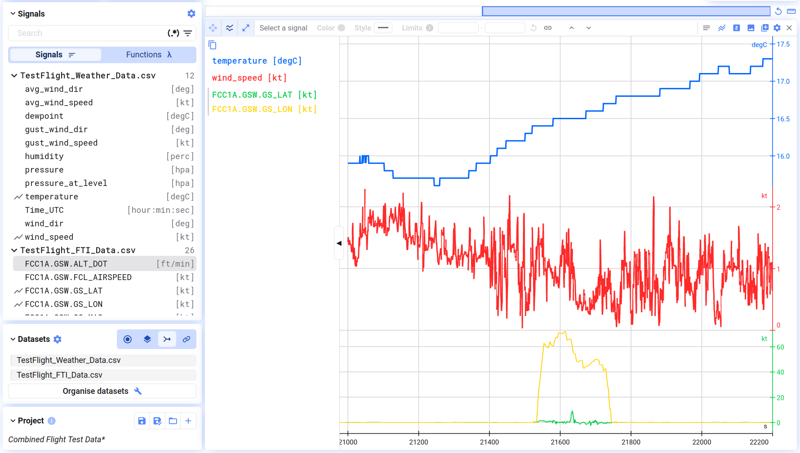
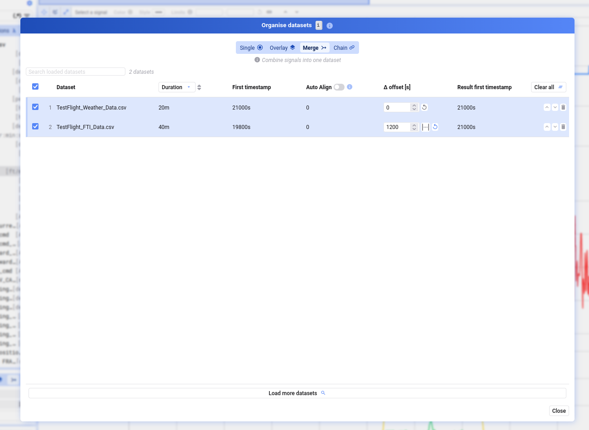
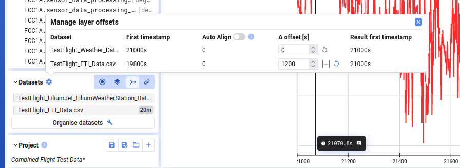

Ist eine Aufzeichnung über mehrere Datensätze verteilt, führt Merge sie zusammen, sodass alle Signale gemeinsam in einem Datensatz verfügbar sind.

## Merge aktivieren

Wählt beim Visualisieren mehrerer Datensätze **Merge** im Dialog, oder wechselt jederzeit über den **Datasets**-Dialog (unten links im Tab) dorthin. Die Signal List zeigt danach die Signale aller zusammengeführten Datensätze gemeinsam an, gruppiert pro Datensatz.

## Auswählen, welche Datensätze zusammengeführt werden

Öffnet **Organise datasets** (Button im Datasets-Dialog, oder <kbd>i</kbd>). Im Merge-Modus hat jeder Datensatz eine Checkbox — anhaken oder abwählen, um ihn ein- oder auszuschließen, oder die Checkbox im Header nutzen, um alle auf einmal (ab)zuwählen.

Enthalten mehrere Datensätze ein Signal mit demselben Namen, wird nur das Signal aus dem ersten Datensatz übernommen.

## Zusammengeführte Datensätze ausrichten

- **First timestamp** — die ursprüngliche Startzeit des Datensatzes
- **Auto-align** — richtet Datensätze mit relativer Zeitbasis automatisch an Datensätzen mit absoluter Zeitbasis aus
- **Delta offset** — zusätzlicher Offset in Sekunden, um einen Datensatz früher oder später zu verschieben; alternativ per Abstand zwischen zwei Cursorn visuell setzen
- **Result first timestamp** — die Startzeit des Datensatzes, nachdem alle Offsets angewendet wurden

Offsets lassen sich über das Zahnrad-Symbol neben **Datasets** oder im Dialog **Organise datasets** festlegen.

{/* UNMATCHED extra screenshot found on live page, no marker to replace */}

