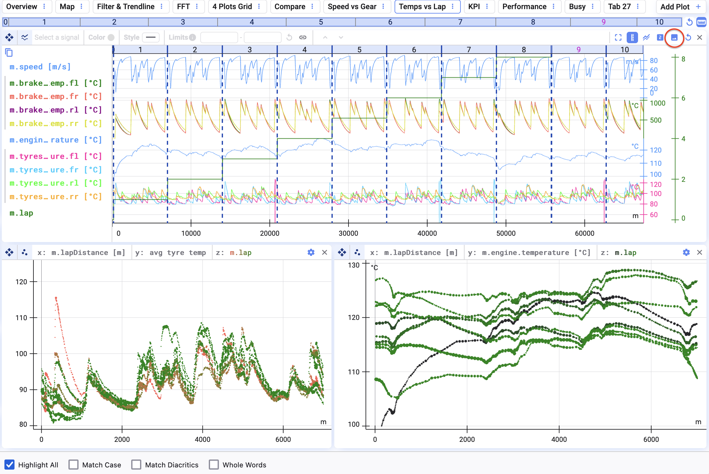
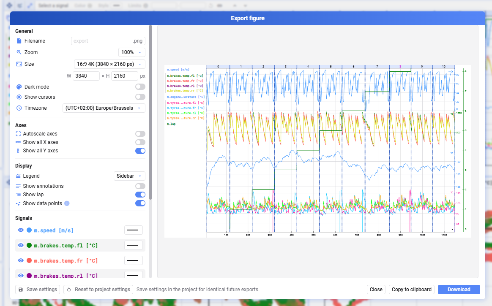
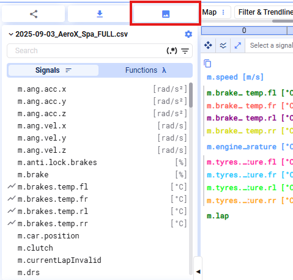
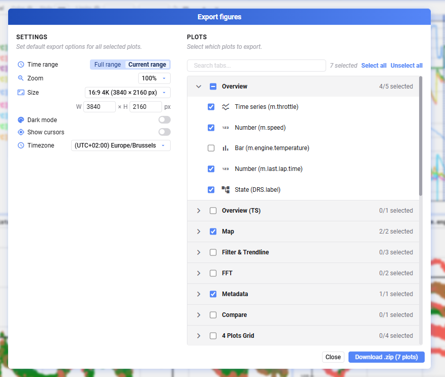

Es gibt zwei Wege, einen Plot zu exportieren:

- Einen einzelnen Plot exportieren
- Mehrere Plots aus einem Project im Bulk exportieren

## Einzelnes Bild exportieren

Um ein statisches Bild eurer aktuellen Visualisierung für die Verwendung in einem anderen Kontext zu speichern, nutzt die Export-Plot-Funktion in der Toolbar über dem Plot.

Ein Dialog öffnet sich, in dem ihr das zu exportierende Bild konfigurieren könnt:

- Allgemeine Einstellungen — Dateiname, Zoom, Bildgröße, Dark Mode, Cursor ein-/ausblenden, Zeitzone
- Plot-spezifische Einstellungen, abhängig vom Plot-Typ

Speichert eure Export-Einstellungen (unten links), um sie später oder in einem Bulk-Export wiederzuverwenden.

## Bulk-Export

Exportiert mehrere Plots aus einem Project — etwa, um sie in einem anderen Reporting-Tool weiterzuverwenden — indem ihr auf den Export-Button oben links klickt.

Legt die allgemeinen Einstellungen fest und wählt die Plots aus, die im Export enthalten sein sollen. Der Download enthält eine `.zip`-Datei mit einem Export aller ausgewählten Plots.

