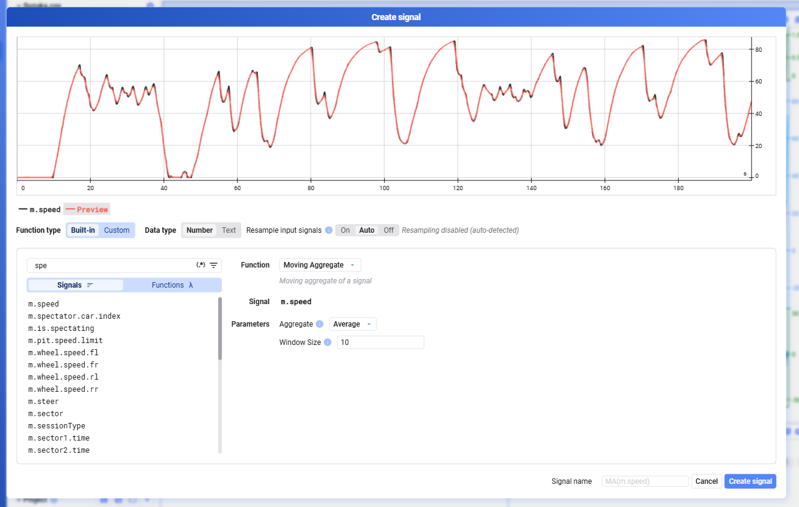

Wählt im Dialog **Create signal** den Function-Typ **Built-in**, wählt das gewünschte Signal aus und füllt die erforderlichen Parameter aus.

| Function | Beschreibung | Parameter |
|---|---|---|
| Moving Aggregate | Gleitender Aggregatwert eines Signals | Aggregate — die Art des gleitenden Aggregats; Window Size — Anzahl der Samples, über die gemittelt wird |
| Cumulative Sum | Kumulative Summe eines Signals | Gain — die Verstärkung des Signals |
| Integral | Integral eines Signals nach der Mittelpunktregel | Gain — die Verstärkung des Signals |
| Linear Calibration | Lineare Kalibrierung eines Signals | Gain — die Verstärkung des Signals; Offset — der Offset des Signals |
| Clip | Rückwärtsdifferenz eines Signals, also v(t) − v(t−1) | Gain — die Verstärkung des Signals |
| Derivative | Diskrete Rückwärtsableitung eines Signals, also (v(t) − v(t−1)) / dt | Gain — die Verstärkung des Signals |
| Remove outliers, stddev | Ausreißer eines Signals per Standardabweichung entfernen | Std — die Standardabweichung des Signals |
| Remove outliers, fixed limits | Ausreißer eines Signals per festen Grenzwerten entfernen | Min, Max |
| Sample shift | Signal um eine Anzahl Samples verschieben | Shift — Anzahl der Samples, um die verschoben wird |
| Zeroing | Signal so verschieben, dass es am ersten Datenpunkt im Zoom-Bereich 0 ist | — |
| Time | Die Zeitachse eines Signals auswählen | — |
