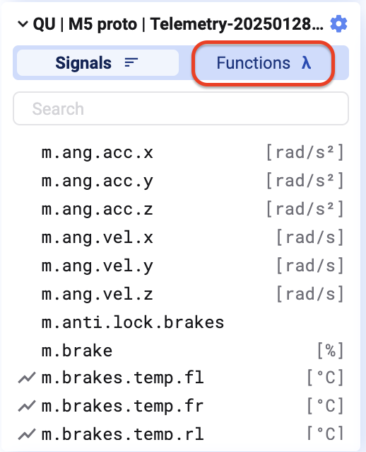
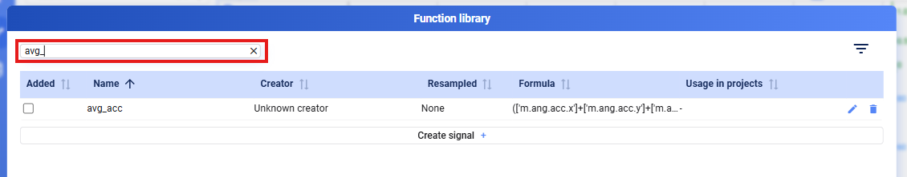
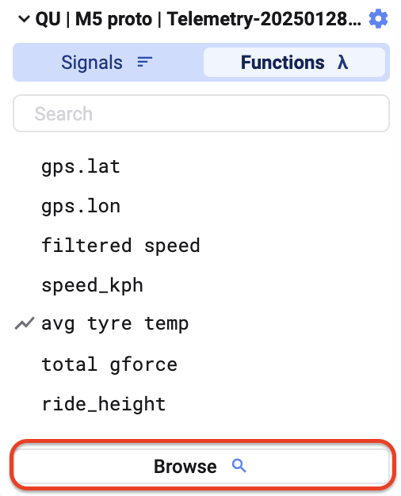
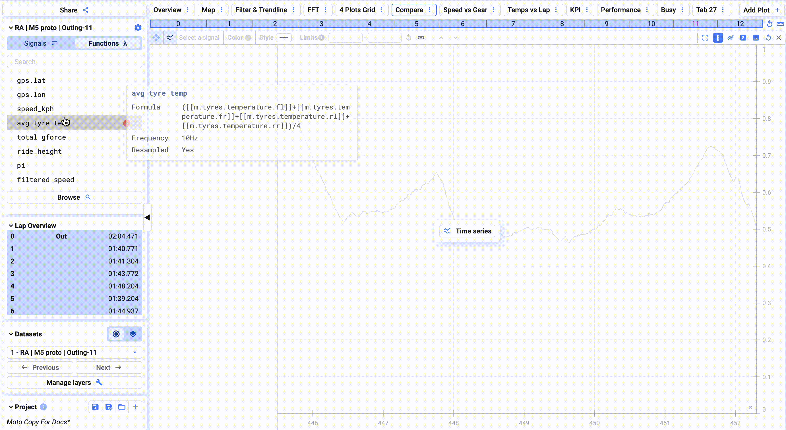
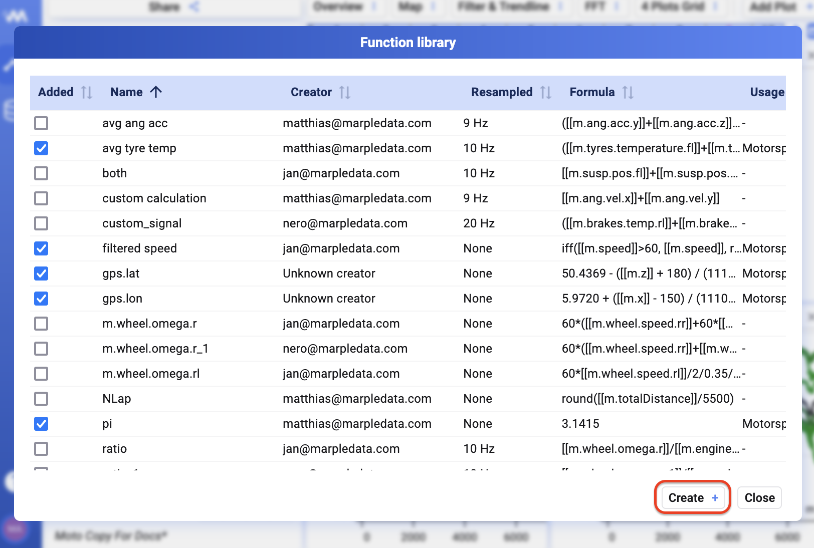

Wechselt in der Signal List zu **Functions**, um alle Functions zu sehen, die eurem Projekt bereits hinzugefügt sind. Über das Suchfeld oben findet ihr eine bestimmte Function schnell.

## Function zu einem Projekt hinzufügen

Genauso wie beim Hinzufügen eines Signals: doppelklicken oder per Drag-and-Drop auf einen Plot ziehen.

## Function Library

Klickt auf **Browse**, um die **Function Library** zu öffnen — eine Übersicht aller Functions, die in eurem Workspace erstellt wurden. Über die Suchleiste und das Filter-Symbol oben im Dialog lässt sich die Liste durchsuchen bzw. filtern.

## Neue Function erstellen

Klickt unten links im Function-Library-Dialog auf **Create**. Die zwei Wege, eine Function zu definieren, stehen unter [Built-in functions](/de/deepview/analysis/functions/built-in-functions) und [Custom functions](/de/deepview/analysis/functions/custom-functions).

{/* UNMATCHED extra screenshot found on live page, no marker to replace */}

