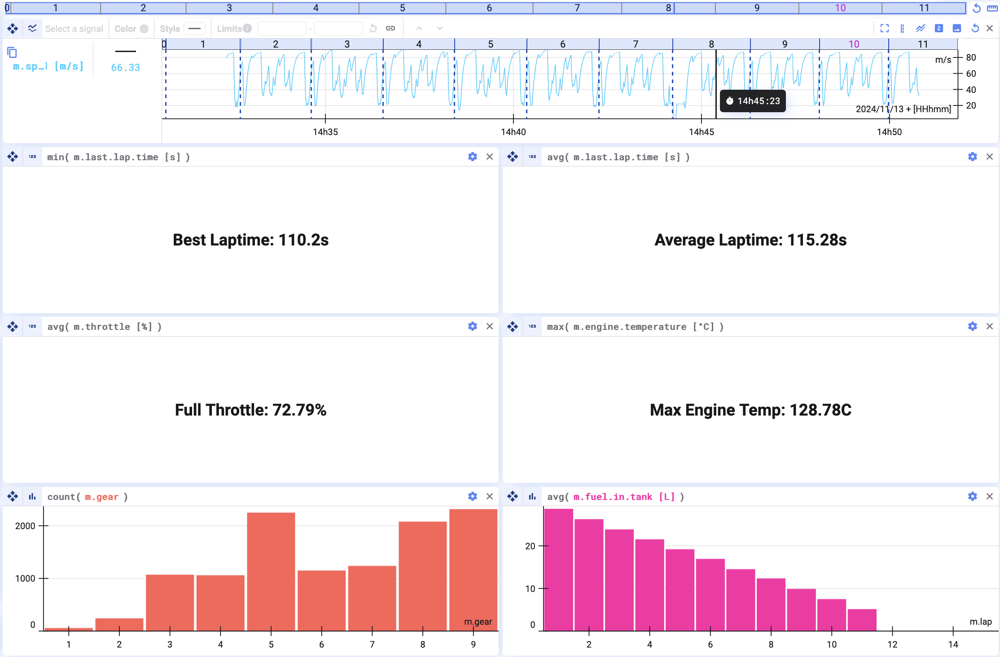
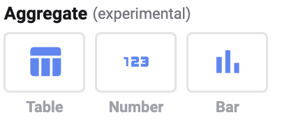
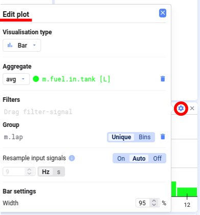
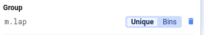
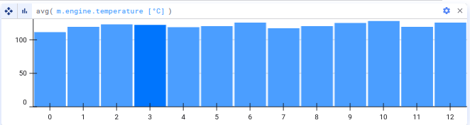
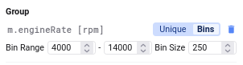
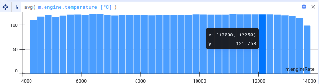
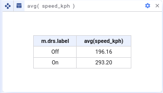
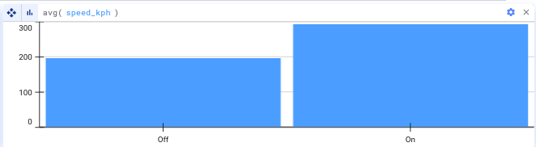

Oft erzählt ein Graph eine bessere Geschichte als tausend Datenpunkte. Manchmal steckt die Wahrheit aber wirklich in einer einzelnen Zahl.

Deepview trägt dem Rechnung, indem es euch erlaubt, eurem Projekt Aggregate hinzuzufügen.

Es gibt drei Formate, in denen ihr Aggregate zu eurem Projekt hinzufügen könnt:

- **Table format** — nützlich, um eine Menge Daten entlang zweier Variablen darzustellen
- **Number format** — nützlich, um eine einzelne Zahl darzustellen
- **Bar format** — ähnlich dem Table-Format, aber visueller

## Erste Schritte

Klickt auf **Add Plot** und wählt das gewünschte Aggregate-Format.

## Aggregat bearbeiten

Unabhängig vom gewählten Format klickt oben rechts im Plot auf das Einstellungsrad, um zu bearbeiten, wie das Aggregat berechnet wird.

## Aggregate Method

Im Bearbeitungsbildschirm wählt ihr die Methode, mit der das Aggregat berechnet wird. Aktuell verfügbar:

- Average
- Minimum
- Maximum
- Sum
- Count

## Filter

Im Filter-Bereich legt ihr die Bedingungen fest, unter denen die Metrik berechnet wird.

Ein Filter ist optional. Definiert ihr mehrere Filter, müssen alle wahr sein — Filter1 UND Filter2 müssen beide zutreffen, damit ein Datenpunkt ins Aggregat einfließt.

## Group by

Soll das Aggregat eine Tabelle oder ein Balkendiagramm sein, wählt ein Signal, nach dem die Berechnung gruppiert wird. Zieht dazu ein Signal per Drag-and-Drop aus der Signal List.

Es gibt zwei Arten, die Daten zu gruppieren:

- **Unique** — erstellt eine Gruppe für jeden eindeutigen Wert des Signals; ideal für diskrete oder Text-Signale
- **Bins** — legt manuell den **Bin Range** (den Bereich der Y-Achsen-Werte des Signals, der berücksichtigt wird) und die **Bin Size** (die Einheit, in die der Bereich unterteilt wird) fest; nützlich bei kontinuierlichen Signalen

Ein Beispiel: Ist das Aggregate-Format ein Balkendiagramm und das Aggregat der Durchschnitt der Motortemperatur (`avg(m.engine.temperature)`), erhaltet ihr ein Balkendiagramm mit der Verteilung der durchschnittlichen Motortemperatur pro Zyklus.

Wollt ihr die durchschnittliche Motortemperatur abhängig von der Motordrehzahl sehen, gruppiert nach dem Motordrehzahl-Signal und legt Bin-Limits und -Breite entsprechend fest.

Ihr könnt außerdem die verschiedenen Eingangssignale resamplen, um Signale mit unterschiedlichen Zeitbasen gemeinsam zu nutzen. Details siehe [Resampling](/de/deepview/analysis/resampling).

## Bar Settings

Habt ihr ein Balkendiagramm zur Visualisierung eures Aggregats gewählt, könnt ihr zusätzlich die Breite der Balken als Anteil des verfügbaren Platzes festlegen.

## Text Data

Ihr könnt Textdaten zur Gruppierung in Balkendiagrammen und Tabellen nutzen — die Werte werden dabei als Labels im Plot verwendet.

{/* UNMATCHED extra screenshot found on live page, no marker to replace */}

