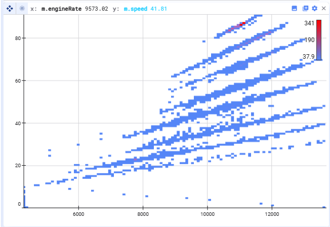

Die **Heatmap** zeigt, wie Datenpunkte über zwei Dimensionen verteilt sind. Der Plot-Bereich ist in *Buckets* (Rasterzellen) unterteilt, und jeder Bucket wird danach eingefärbt, wie viele Punkte darin liegen — so lassen sich Cluster, Lücken und Dichtemuster leicht erkennen.

**So lest ihr sie** (mit Standardfarben):

- **Blau** = weniger Punkte in einem Bucket
- **Rot** = mehr Punkte in einem Bucket
- Buckets zwischen diesen Extremen sind in einem Blau-zu-Rot-Verlauf schattiert

## Einstellungen

Erreichbar über das Einstellungsrad oben rechts im Plot:

- **X and Y axes** — legt fest, welche Variablen die horizontale und vertikale Dimension bilden
- **Plot limits** — die Limits der X- oder Y-Achse, oder *auto* für Min/Max aus den Daten
- **Resample signals** — relevant, wenn eure Signale unterschiedliche Timestamps haben; Details siehe [Resampling](/de/deepview/analysis/resampling)
- **Color range** — ändert die untere und obere Farbe (Standard ist Blau–Rot) oder den Bucket-Count-Anteil; Buckets mit weniger Punkten als einem festgelegten Anteil des am stärksten besetzten Buckets werden in der unteren Farbe angezeigt, Buckets mit mehr Punkten in einem Verlauf bis zur oberen Farbe
- **Opacity** — die Deckkraft des Plots
- **Filters** — Datenpunkte anhand von Bedingungen filtern

