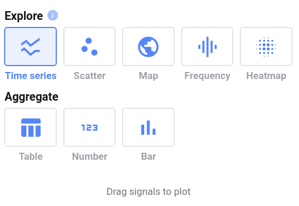
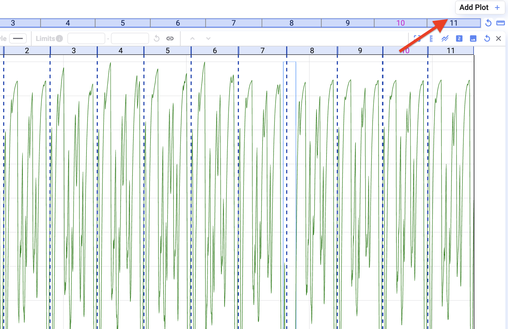

Deepview bietet acht Plot-Typen:

- [Time Series](/de/deepview/analysis/plot-types/time-series)
- [Scatter](/de/deepview/analysis/plot-types/scatter)
- [Map](/de/deepview/analysis/plot-types/map)
- [Frequency (FFT)](/de/deepview/analysis/plot-types/frequency-fft)
- [Heatmap](/de/deepview/analysis/plot-types/heatmap)
- [Metadata](/de/deepview/analysis/plot-types/metadata)
- [State](/de/deepview/analysis/plot-types/state)
- [Message](/de/deepview/analysis/plot-types/message)

Zusätzlich könnt ihr Aggregate-Ansichten zu eurem Plot hinzufügen.

- [Aggregates](/de/deepview/analysis/plot-types/aggregates)

## Plot zu eurem Projekt hinzufügen

Startet ihr ein neues Projekt oder einen neuen Tab innerhalb eines bestehenden Projekts, werdet ihr aufgefordert, einen Plot-Typ auszuwählen.

Um einem bestehenden Tab einen Plot hinzuzufügen, klickt oben rechts auf den Button **Add Plot**.

