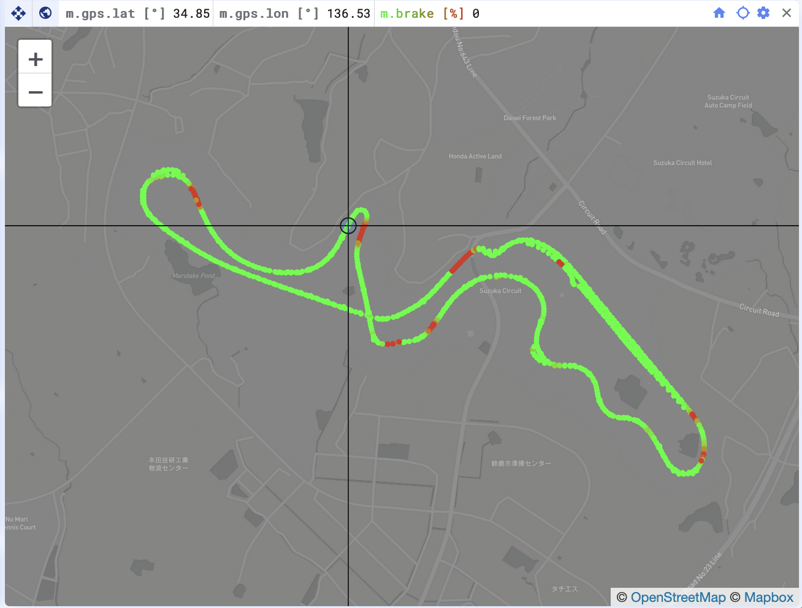
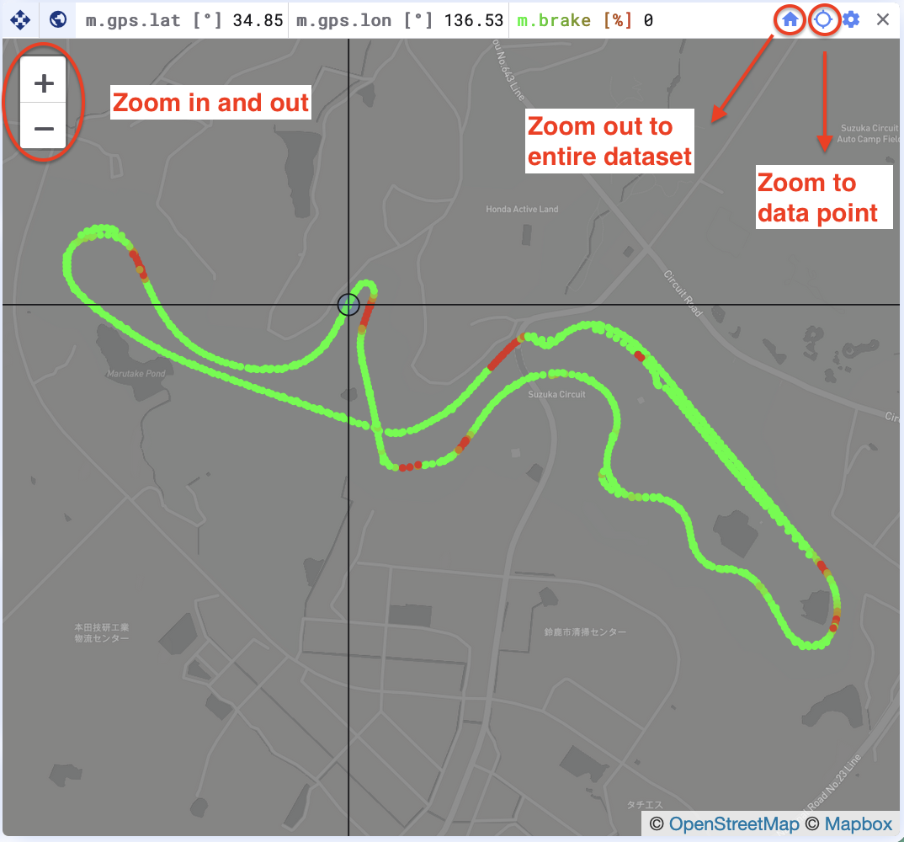
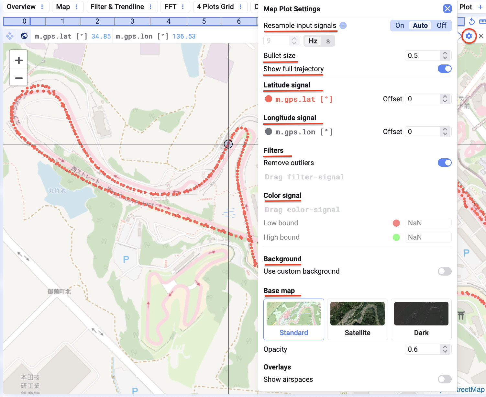

Der Map-Plot dient zur Darstellung von Geodaten.

Um den Plot zu nutzen, zieht ein in Grad angegebenes Latitude- und Longitude-Signal per Drag-and-Drop auf den Plot.

## Zoom

Ihr könnt die Daten mit den +/--Symbolen zoomen und schwenken, oder durch Ziehen und Scrollen im Plot.

- Um herauszuzoomen und den **gesamten Datensatz** zu sehen, klickt oben rechts im Plot auf das Haus-Symbol.
- Um auf den **aktuellen Datenpunkt** hineinzuzoomen, klickt auf das Lupen-Symbol, ebenfalls oben rechts im Plot.

## Weitere Einstellungen

Klickt oben rechts im Plot auf das Einstellungsrad, um ihn zu konfigurieren.

### Eingangssignale resamplen

Wie beim Scatter-Plot könnt ihr die Eingangssignale resamplen, um ihre Zeitbasis für eine konsistente Analyse anzugleichen.

### Bullet-Größe

Passt die Bullet-Größe nach euren Wünschen an, damit Datenpunkte klarer erkennbar sind.

### Vollständige Trajektorie anzeigen

Legt fest, ob alle Datenpunkte angezeigt werden sollen, oder nur der Datenpunkt an der aktuellen Cursor-Position auf der Zeitachse.

### Latitude- und Longitude-Offset festlegen

Stimmen die Longitude- oder Latitude-Werte nicht korrekt mit der Karte überein, könnt ihr einen Offset anwenden, um die Positionierung anzupassen.

### Filters

Um Ausreißer zu filtern, fügt ein Kontrollsignal hinzu und legt einen Offset-Wert fest, um unerwünschte Datenpunkte auszublenden.

## Color-Signal

Fügt ein drittes Signal hinzu (z. B. Speed) und legt untere und obere Grenzwerte fest, um Datenpunkte dynamisch anhand dieses Signals einzufärben — das liefert eine zusätzliche Informationsebene in eurer Visualisierung.

### Hintergrund

Der Standard-Hintergrund ist [OpenStreetMap](https://www.openstreetmap.org/). Ihr könnt zwischen Standard-, Satelliten- und Dark-Map wechseln und die Deckkraft für eine bessere Sichtbarkeit anpassen.

Ihr könnt außerdem einen **eigenen Hintergrund** hinzufügen:

1. Klickt oben rechts auf das **Einstellungsrad**.
2. Aktiviert **"Use Custom Background"**.
3. Ladet eure Datei hoch.

### Overlays

Erweitert eure Karte um Overlays, z. B. **Anlagengrenzen oder Geofences**, für zusätzlichen Kontext.

{/* UNMATCHED extra screenshot found on live page, no marker to replace */}

