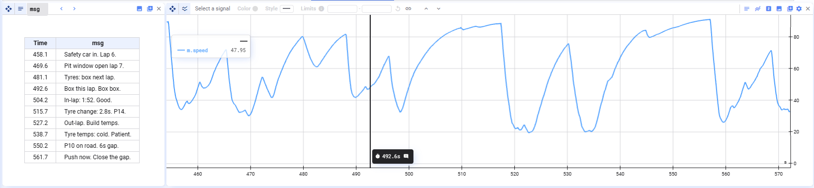

Message-Plots sind für niederfrequente Meldungen und Status-Logs gedacht. Sie liefern eine übersichtliche Tabellenansicht eurer Signale mit Timestamps und Meldungen nebeneinander.

Klickt ihr auf eine Meldung in einem Message-Plot, springt der Cursor zum entsprechenden Timestamp — so lassen sich Ereignisse leicht mit euren anderen Plots abgleichen.

