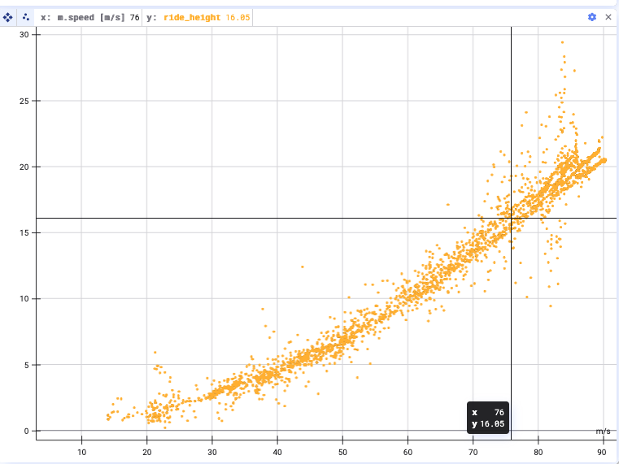
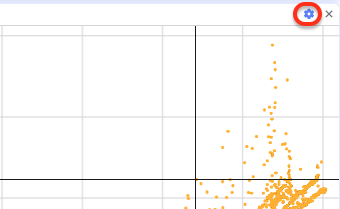
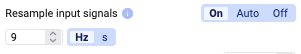
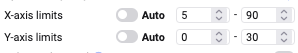
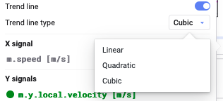
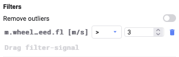
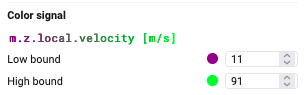

Zu Beginn ist der Scatter-Plot leer.

Zieht Signale per Drag-and-Drop aus der Signal List in die X/Y- oder Color-Signal-Felder, oder doppelklickt sie, um sie dem Plot hinzuzufügen — das funktioniert genauso wie bei einem Time-Series-Plot (siehe [Signal List](/de/deepview/analysis/signal-list#add-signals)).

Nach dem Hinzufügen einiger Signale sieht der Plot etwa so aus:

## Einstellungen

Klickt auf das Einstellungsrad für weitere Konfigurationsmöglichkeiten.

### Eingangssignale resamplen

Ihr könnt das Resampling der Eingangssignale ein- oder ausschalten und die Resampling-Frequenz ändern. Details siehe [Resampling](/de/deepview/analysis/resampling).

### Bullet-Größe ändern

Ihr könnt die Bullet-Größe der im Plot dargestellten Datenpunkte auf eine beliebige Größe ändern.

### Achsen wechseln

Tauscht die X- und Y-Achse, indem ihr auf den Button **cycle through the signals** klickt.

### Limits der X- und Y-Achse anpassen

Legt die **Limits** der X- und Y-Achse fest.

### Subsampling-Grid anzeigen

Schaltet die Anzeige eines **Subsampling-Grids** ein — nützlich für große Datensätze, da diese entlang eines Grids aggregiert werden.

### Trendlinie

Wendet eine Trendlinie an und wählt, ob sie linear, quadratisch oder kubisch sein soll.

### Ausreißer filtern

Um Ausreißer zu filtern, fügt ein weiteres Signal aus der Signal List hinzu und legt einen Grenzwert fest, ab dem Datenpunkte nicht mehr berücksichtigt werden. Ihr könnt mehrere Filter-Signale hinzufügen.

### Color-Signal hinzufügen

Fügt dem Plot eine Farbdimension hinzu, indem ihr ein neues Signal hinzufügt und untere und obere Grenzfarben konfiguriert.

