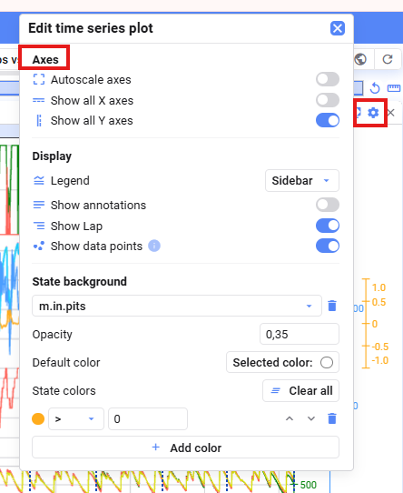
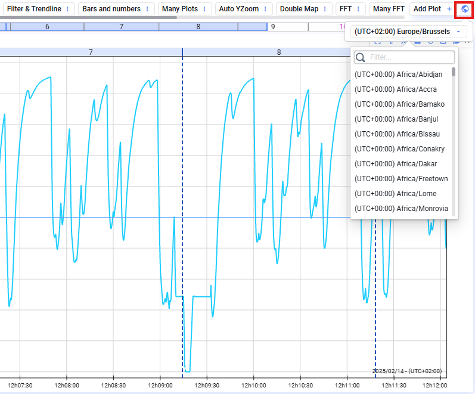

## Allgemein

Die Axes-Einstellungen befinden sich in den Plot-Einstellungen:

- **Autoscale axes** — die Limits jedes Signals beim Zoomen neu skalieren, damit es zur Plot-Position passt
- **Show all X axes** — die X-Achse jedes verglichenen Datensatzes anzeigen (nur verfügbar beim Vergleichen von Datensätzen)
- **Show all Y axes** — die Y-Achse jeder verknüpften Signalgruppe anzeigen

## Zeitzone für die X-Achse

Epoch-Timestamps werden standardmäßig in der lokalen Zeitzone eures Browsers angezeigt. Nutzt den **Zeitzone**-Button oben rechts in der Visualisierung, um eine andere auszuwählen.

