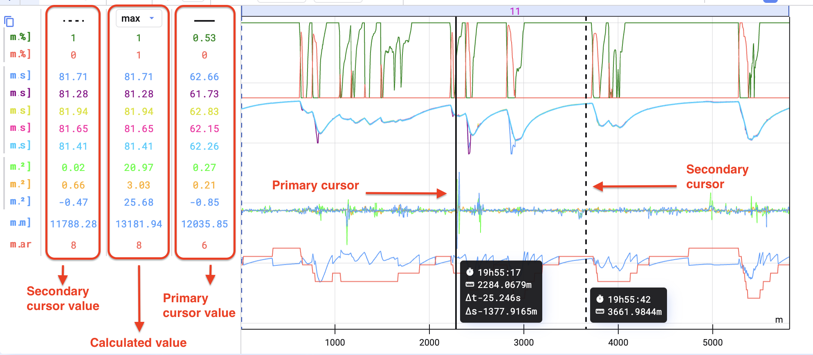
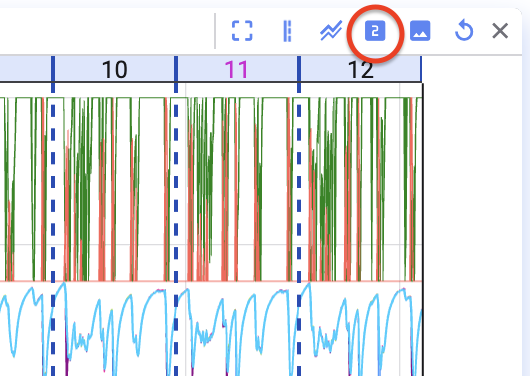
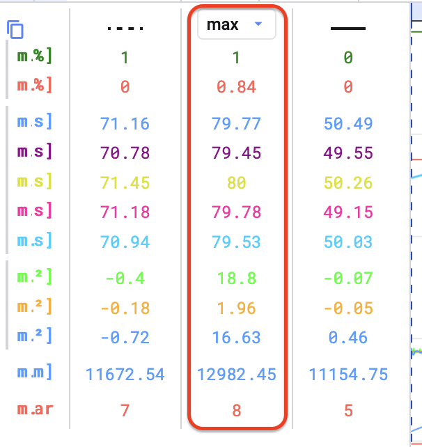

Cursors zeigen den Wert visualisierter Signale an einem bestimmten Punkt auf der Zeitachse. Fügt einen zweiten Cursor hinzu, um Differenz, Minimum, Maximum und Mittelwert zwischen den beiden Punkten zu berechnen.

## Primären Cursor setzen

Klickt auf den Punkt im Time-Series-Plot, an dem der Cursor stehen soll.

## Sekundären Cursor setzen

Fahrt mit der Maus über den Plot und drückt <kbd>Space</kbd>, oder klickt in der Toolbar über dem Plot auf **Enable Secondary Cursor**. Drückt <kbd>Escape</kbd> oder klickt erneut auf den Button, um ihn zu entfernen.

## Berechnungen zwischen den Cursorn

Die Ergebnisse erscheinen links vom Plot, zwischen dem primären Cursor (durchgezogene Linie) und dem sekundären Cursor (gepunktete Linie).

