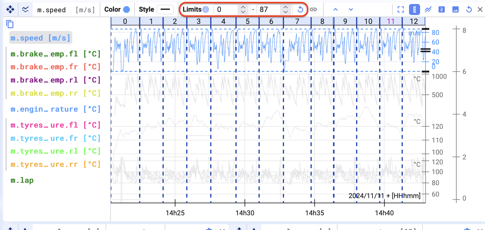
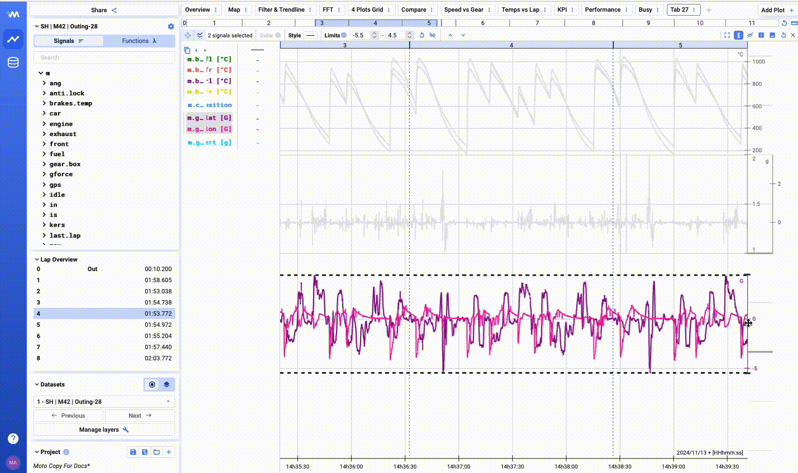
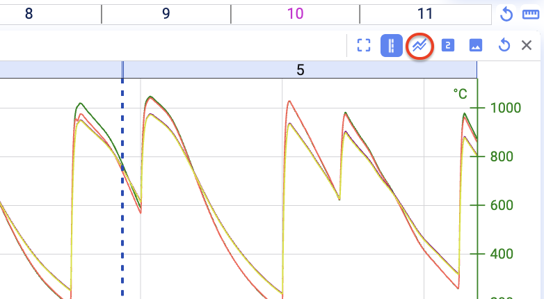
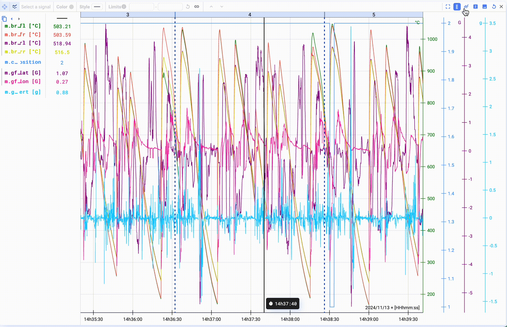
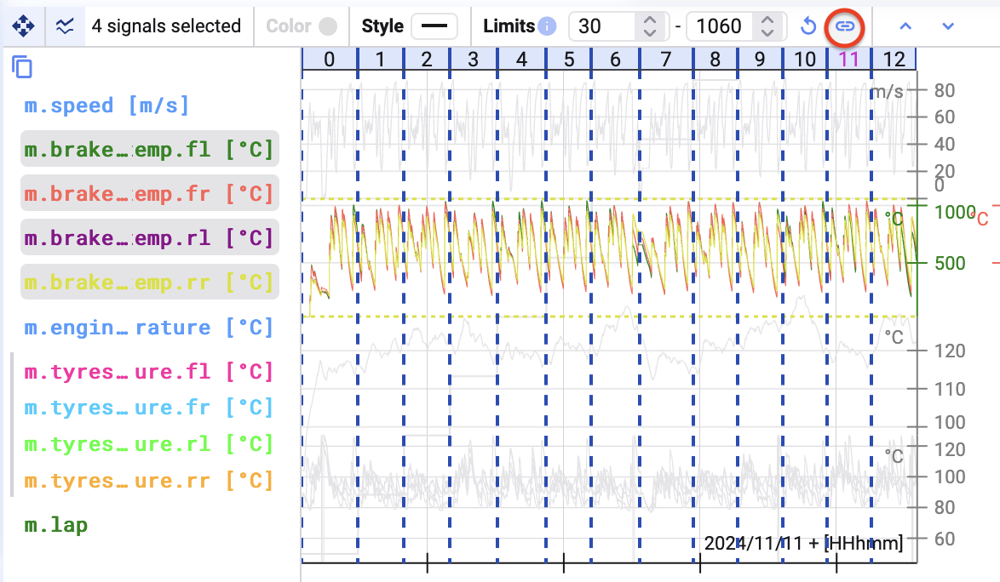

## Limits

Limits sind die Bereiche der Y-Achse, die Deepview visualisiert. Es gibt zwei Limit-Typen: das **Min Limit** und das **Max Limit**.

Deepview visualisiert die Datenpunkte innerhalb von Min und Max Limit. Min und Max Limit lassen sich für jedes Signal einzeln festlegen.

## Stacking

Jede Signalgruppe hat außerdem eine **Position** im Plot, die ihr ändern könnt.

Wählt ihr ein Signal oder eine Signalgruppe aus, seht ihr Drag-Handles an der Achse. Damit könnt ihr die Position eures Signals ändern. Mit den Positionen lassen sich visuell übersichtliche Plots erstellen.

Standardmäßig werden in Time-Series-Plots alle hinzugefügten Signale und Signalgruppen mit ihren Limits am oberen und unteren Rand des Plots ausgerichtet. Das bedeutet, die Graphen liegen übereinander.

Wollt ihr die Graphen automatisch übereinander stapeln, klickt oben in der Leiste auf den Button **Stack All Signals**.

Nach dem Klick auf **Stack All Signals** werden die Signale im Plot übereinander gestapelt.

## Limits verknüpfen

**Verknüpft (Link)** mehrere Signale, wenn deren Limits und Positionen immer gleich sein sollen. Dadurch werden diese Signale zu einer Signalgruppe (siehe [Signal Settings](/de/deepview/analysis/plot-types/time-series/signal-settings)).

Verknüpfte Signale teilen sich dieselbe Y-Achse. Wählt mehrere Signale aus (<kbd>ctrl/cmd</kbd> + Linksklick) und klickt auf den Link-Button.

