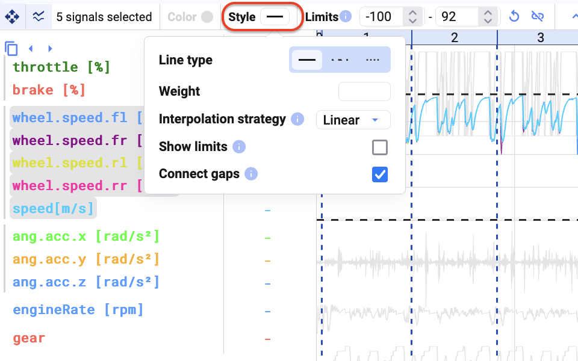
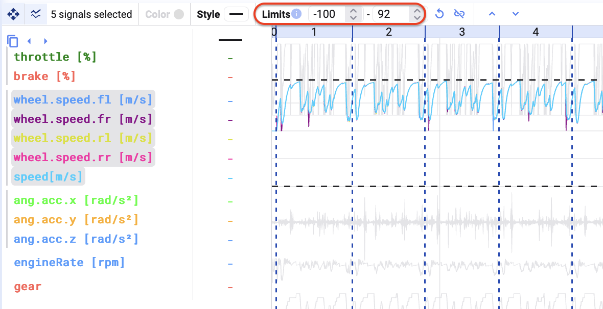
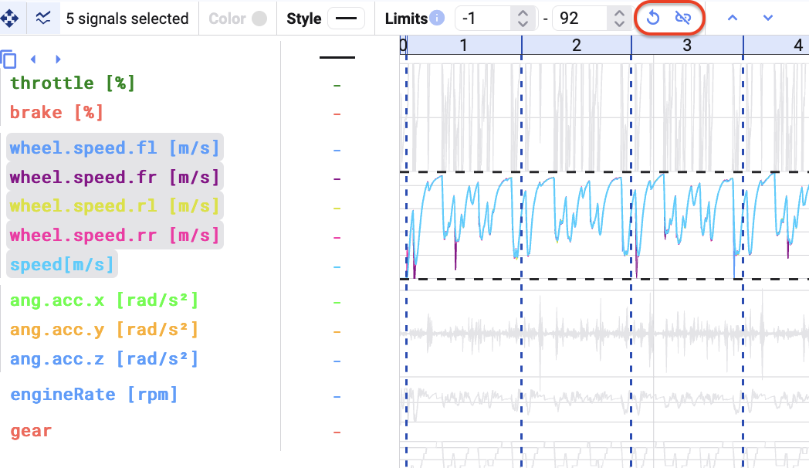
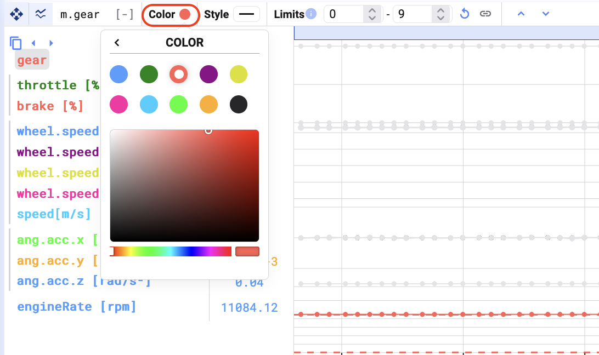
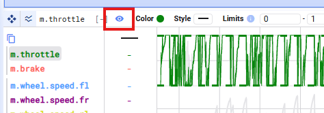
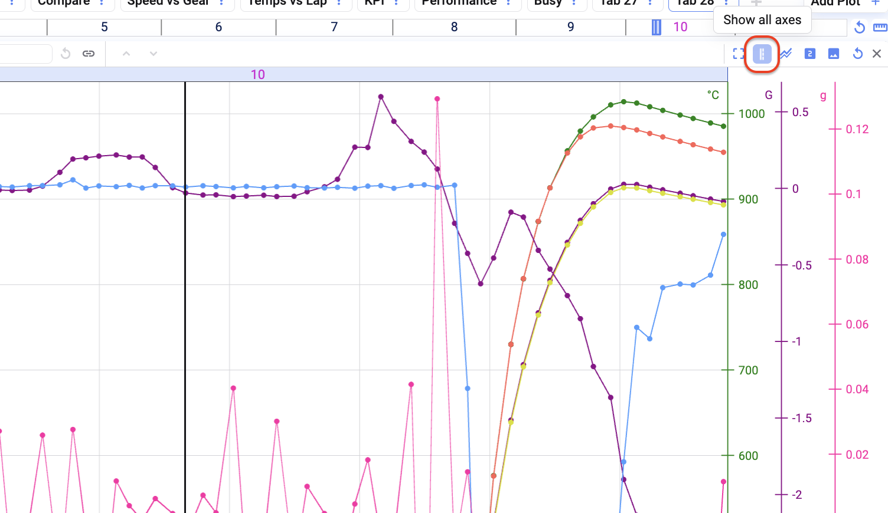

Wählt ihr ein Signal oder eine Signalgruppe aus, könnt ihr dessen Darstellung im Plot ändern.

- Den Style der Signale ändern.

- Die Limits der Signale in der Gruppe ändern (Minimum und Maximum der Y-Achse). Die Änderung der Limits gilt für die gesamte Gruppe.

- Die Limits der Gruppe zurücksetzen oder die Signale entkoppeln.

- Bei Auswahl eines einzelnen Signals könnt ihr zusätzlich dessen Farbe ändern.

- Ein Signal im Plot ausblenden, aber in der Cursor-Werte-Tabelle sichtbar lassen.

## Signal-Y-Achsen ein- oder ausblenden

Fügt ihr mehrere Signale zu einem Plot hinzu, die nicht alle zur selben Gruppe gehören (oder nicht dieselben Limits teilen), werden die mehreren Y-Achsen standardmäßig ausgeblendet.

Wollt ihr diese Achsen wieder anzeigen, klickt in der Toolbar auf den Button **Show all axes**.

