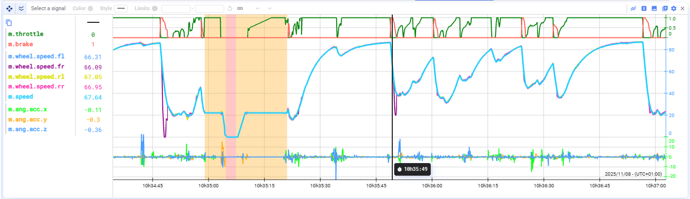
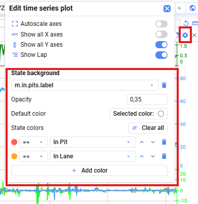

Ihr könnt den Hintergrund eines Time-Series-Plots anhand des Zustands oder Werts eines anderen Signals einfärben.

So konfiguriert ihr die Hintergrundfarbe:

1. Öffnet die **Plot-Einstellungen** eures Time-Series-Plots.
2. Zieht ein Signal in den Bereich **State background** oder wählt es dort aus.
3. Legt fest, welche Zustände oder Werte welchen Hintergrundfarben entsprechen sollen.
4. Die Regeln werden **von oben nach unten** angewendet — der Hintergrund wird gemäß der **ersten zutreffenden Regel** eingefärbt.

