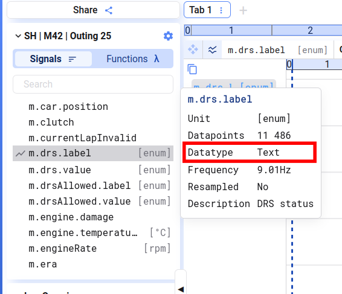
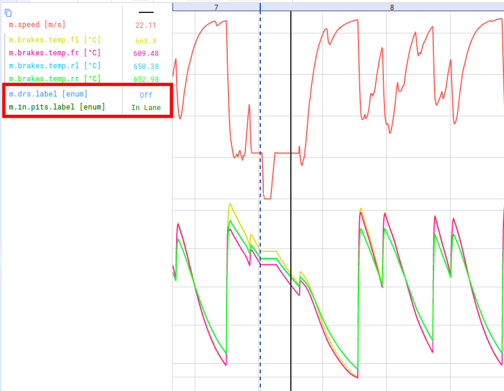

Text-Signale erkennt ihr am Datentyp `Text`.



Text-Signale lassen sich zu Time-Series-Plots hinzufügen. Sie erscheinen nicht als zusätzliche Linie im Plot, aber ihr Wert am Cursor wird zusammen mit den anderen Cursor-Werten angezeigt.



## Zwischen Zahlen- und Text-Signalen umwandeln

Wollt ihr visualisieren, wie sich ein Text-Signal über die Zeit verändert, könnt ihr eine Function erstellen, die die verschiedenen Textwerte in Zahlen umwandelt, und diese Function plotten. Eine ähnliche Formel lässt sich nutzen, um aus einem diskreten Zahlensignal ein Text-Signal zu erstellen.

Hier ein Beispiel, das ein diskretes Signal `state_code` in ein Text-Signal `state_name` umwandelt (PostgreSQL-Syntax — siehe [Custom functions](/de/deepview/analysis/functions/custom-functions)):

Text zu Zahl:

```sql
CASE
    WHEN [[state_name]] = 'Fault' THEN -1
    WHEN [[state_name]] = 'Idle' THEN 0
    ELSE 1
END
```

Zahl zu Text:

```sql
CASE
    WHEN ([[state_code]]::int) = 0 THEN 'Idle'
    WHEN ([[state_code]]::int) = 1 THEN 'Running'
    ELSE 'Fault'
END
```
