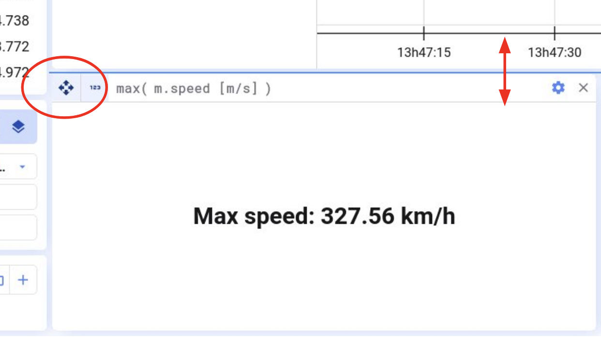
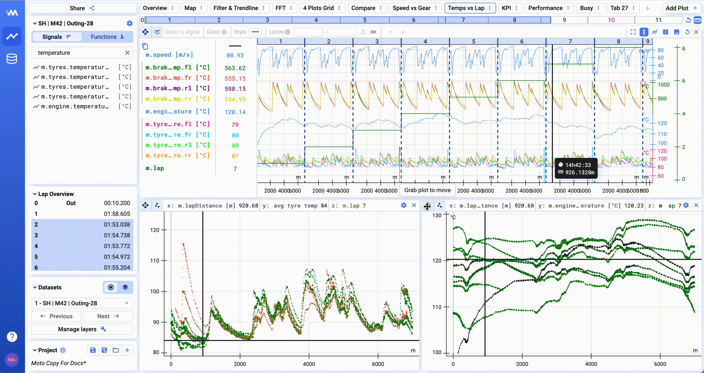
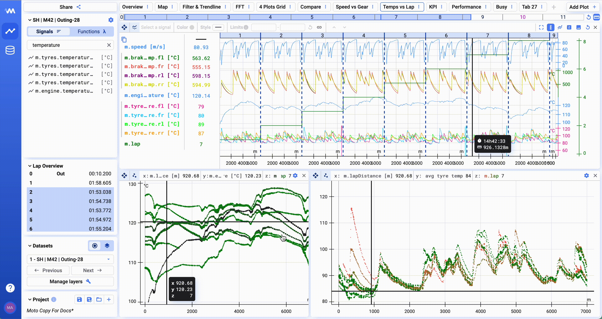

Um Plots neu anzuordnen, greift das Pfeil-Symbol oben links im Plot und zieht ihn an die gewünschte Position.

Hier ein Beispiel, wie ihr eure Plots neu anordnen könnt:

Ihr könnt Plots außerdem breiter oder schmaler machen, indem ihr an ihren Rändern zieht.

{/* UNMATCHED extra screenshot found on live page, no marker to replace */}

