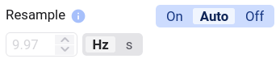

In vielen Deepview-Funktionen müssen mehrere Signale kombiniert werden: in Functions, Scatter-Plots, Tabellen, Filtern und mehr. Haben diese Signale unterschiedliche Zeitbasen, wird es schwer zu wissen, welche Datenpunkte von Signal A zu welchen Datenpunkten von Signal B gehören.

Manche Tools erlauben es nicht, Signale mit unterschiedlichen Zeitbasen zu kombinieren. In Deepview wird das durch **Resampling** der Signale gelöst.

Müssen mehrere Signale kombiniert werden, könnt ihr wählen, wie das geschieht:

- [`off`](#resampling-off) — nicht resamplen, nur die ursprünglichen Timestamps verwenden
- [`auto`](#resampling-auto) — mit einer dynamischen Frequenz resamplen, die von den zugrunde liegenden Signalen und dem Datenbank-Verbindungstyp abhängt
- [`on`](#resampling-on) — mit einer ausgewählten Frequenz resamplen

## Resampling off

Bei `off` werden alle Signale anhand ihres exakten Timestamps zusammengeführt. Haben alle Signale Datenpunkte mit **exakt übereinstimmenden Timestamps** (bis auf die Nanosekunde), hat das Ergebnis-Signal ebenfalls einen Datenpunkt zu diesen Timestamps. Datenpunkte mit einem Timestamp, der nicht in allen Ausgangssignalen vorkommt, werden im Ergebnis-Signal ignoriert.

Vorteile:

- Exakte Timestamps bleiben erhalten
- Schneller als `on` oder `auto`

Nutzt `off` nur, wenn ihr sicher seid, dass alle Signale exakt dieselbe Zeitbasis haben — sonst riskiert ihr Datenverlust.

## Resampling auto

`auto` funktioniert im Grunde wie `on`, nur mit dynamischer Auswahl der Frequenz (siehe [Resampling on](#resampling-on) unten). Welche Frequenz verwendet wird, hängt davon ab, ob die Datenbankverbindung Upsampling unterstützt — wird Upsampling unterstützt, wird das Maximum der zugrunde liegenden Frequenzen verwendet, sonst das Minimum.

## Resampling on

Bei `on` (oder `auto`) werden die Eingangssignale mit der ausgewählten Frequenz abgetastet, um das Ausgangssignal zu erzeugen.

Dazu wird der Zeitbereich in **Buckets** (Bins) der Breite `1/Frequenz` Sekunden unterteilt. Innerhalb jedes Buckets wird der **erste Datenpunkt** ausgewählt und erhält einen neuen Timestamp: die Startzeit des entsprechenden Buckets. So haben alle Signale übereinstimmende Timestamps, und Deepview weiß, welche Datenpunkte im Ergebnis-Signal kombiniert werden.

Da Daten pro Bucket aggregiert werden, können sich Timestamps leicht verschieben (um maximal eine Periode).

Der genaue Algorithmus funktioniert je nach Verbindung leicht unterschiedlich.

### Upsampling implementiert

Für die am häufigsten genutzten Datenbankverbindungen upsampled der Algorithmus die Signale zunächst auf eine gemeinsame Zeitachse, indem fehlende Daten mit der angegebenen Frequenz **forward-gefüllt** werden. Die upgesampleten Signale mit der gemeinsamen Zeitachse werden dann wie oben beschrieben zum Ergebnis-Signal kombiniert. Bei `auto` wird die **höchste Frequenz** ausgewählt.

Forward Fill sorgt dafür, dass keine Daten erfunden werden und Integer-Signale Integer bleiben.

Die folgenden Abbildungen zeigen, was je nach gewählter Frequenz passiert:

### Upsampling nicht implementiert

Für einige seltener genutzte Datenbankverbindungen ist Upsampling noch nicht implementiert, und Resampling nutzt stattdessen die Rohdaten des Signals. Für diese Verbindungen verwendet `auto` automatisch die **niedrigste Frequenz** — eine höhere Frequenz einzustellen liefert keine zusätzlichen Daten.

## Die richtige Frequenz wählen

In den meisten Fällen ist es am besten, `auto` die optimale Frequenz bestimmen zu lassen. In folgenden Fällen ist es sinnvoll, davon abzuweichen:

- Alle eure Daten haben **exakt denselben Timestamp** (z. B. aus CSV-Dateien oder derselben Gruppe innerhalb einer MDF-Datei) — dann könnt ihr bedenkenlos `off` nutzen
- Ihr habt einen sehr komplexen Plot mit vielen Functions und/oder Filtern, der eine Weile zum Laden braucht, und euch interessiert eher ein **schneller Überblick** als exakte Daten — verringert die vorgeschlagene Frequenz; ihr verliert dabei etwas Daten, aber der Plot lädt schneller
