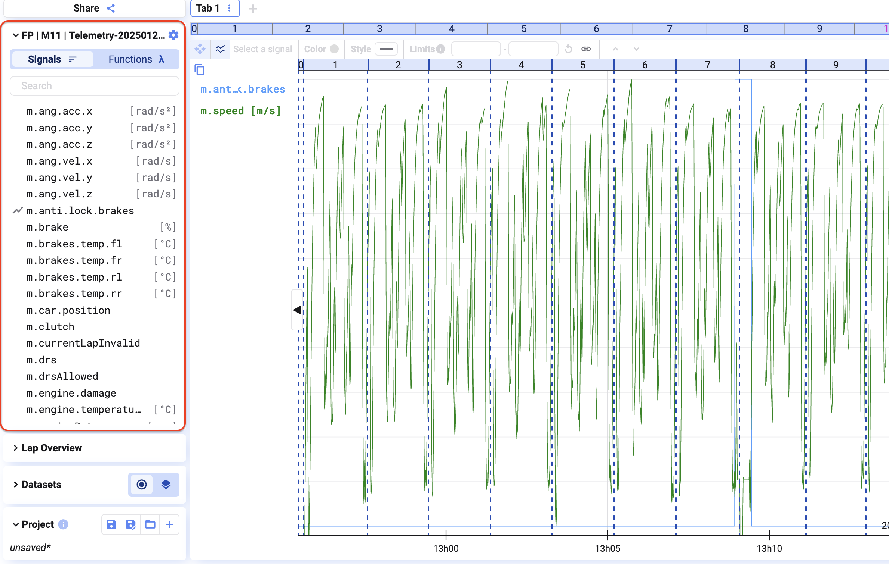
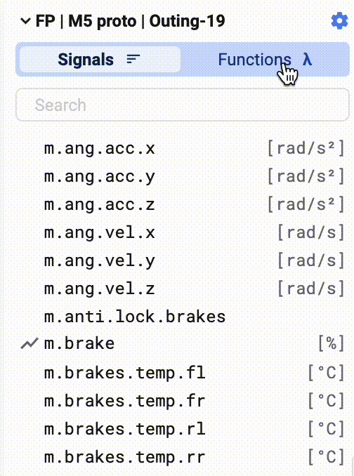
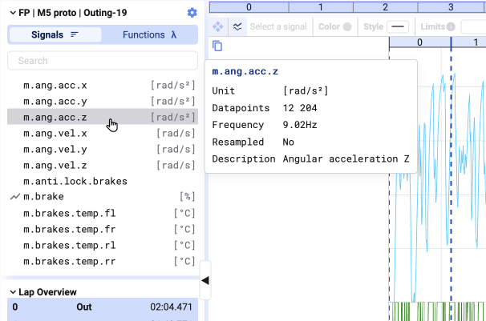
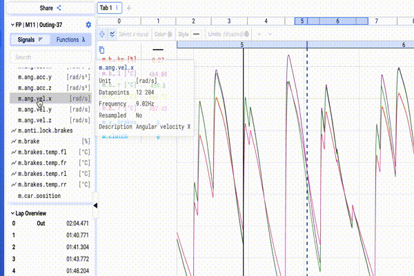
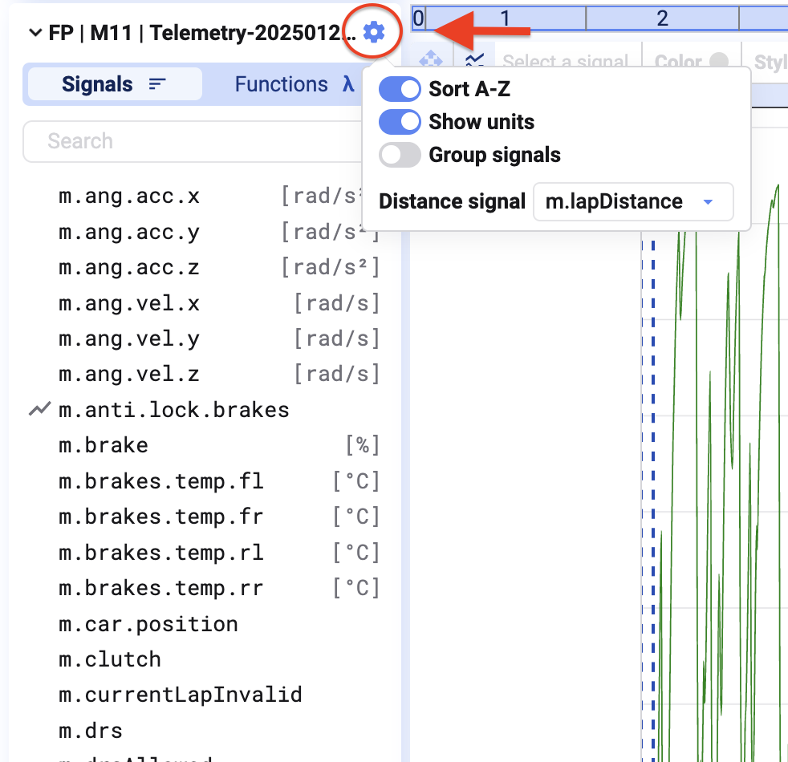
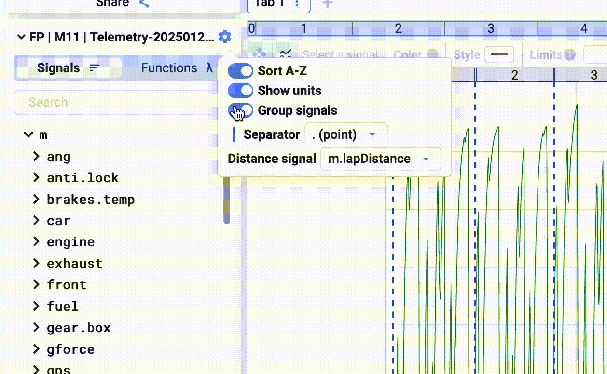

Sobald ein Datensatz in eurem Projekt geladen ist, wählt ihr die zu visualisierenden Signale aus der Signal List links im Bildschirm aus.

Standardmäßig zeigt die Signal List die Rohsignale eines Datensatzes. Über den Schalter oben in der Liste wechselt ihr zur Anzeige der Functions.

## Signal-Metadaten

Fahrt mit der Maus über einen Signalnamen, um dessen Metadaten zu sehen. Wie Metadaten konfiguriert werden, steht unter [Database](/de/deepview/database#signal-metadata).

## Signale zu einem Plot hinzufügen

Doppelklickt ein Signal oder zieht es per Drag-and-Drop auf einen Plot.

Über das Suchfeld findet ihr ein Signal per Fuzzy-Suche über alle verfügbaren Signale — Tippfehler und Groß-/Kleinschreibung (z. B. "t" statt "T") stören dabei nicht.

## Einstellungen der Signal List

Klickt oben rechts in der Signal List auf das Einstellungssymbol, um:

1. die alphabetische Sortierung ein- oder auszuschalten
2. Signal-Einheiten ein- oder auszublenden
3. Signale zu gruppieren und das Trennzeichen für die Gruppierung festzulegen

{/* UNMATCHED extra screenshot found on live page, no marker to replace */}

