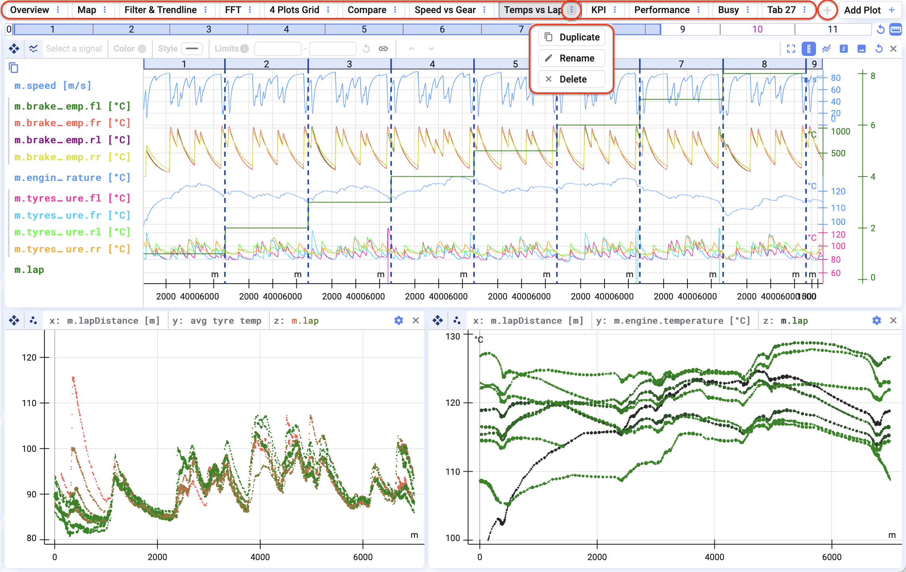
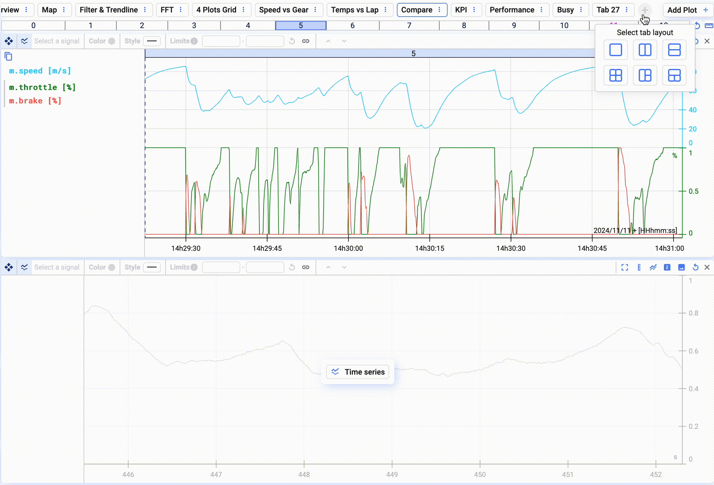

## Overview

Visualisierungen werden in Tabs organisiert. Gute Namen erleichtern es, Daten später wiederzufinden.

Klickt auf die drei Punkte neben einem Tab, um ihn:

- zu duplizieren,
- umzubenennen oder
- zu löschen.

Um einen Tab hinzuzufügen, klickt auf das **+**-Zeichen am Ende der Tab-Liste.

## Tabs neu anordnen

Um Tabs neu anzuordnen, zieht einen Tab per Drag-and-Drop an die gewünschte Stelle.

{/* UNMATCHED extra screenshot found on live page, no marker to replace */}

