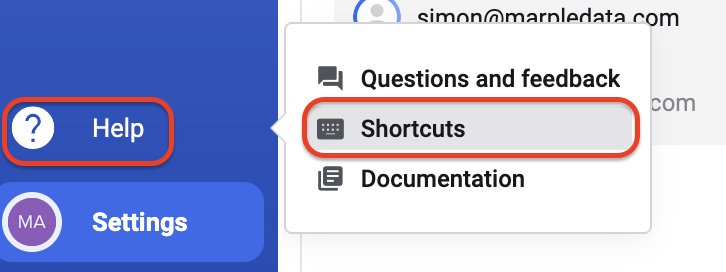

Einige Keyboard-Shortcuts erleichtern die Arbeit mit Deepview deutlich — für Mausaktionen siehe [Mouse Actions](/de/deepview/analysis/mouse-actions).

## Keyboard Shortcuts

| Taste | Aktion |
|---|---|
| `i` | Dialog "Manage Datasets" öffnen |
| `m` | Zwischen einem/mehreren Datasets wechseln |
| `f` | Function Library öffnen |
| `d` | Distance Mode umschalten |
| `ctrl + s` | Project speichern |
| `ctrl + b` | Sidebar einklappen |
| `ctrl + /` | Shortcuts anzeigen (dieser Dialog) |

Um eine Übersicht der Shortcuts zu sehen, klickt in der linken Hauptsidebar auf das **Help**-Icon und dann auf **Shortcuts**.

