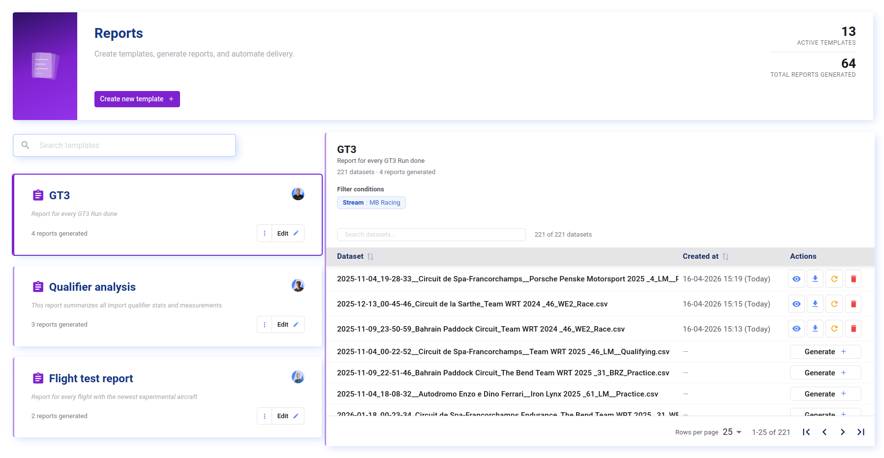
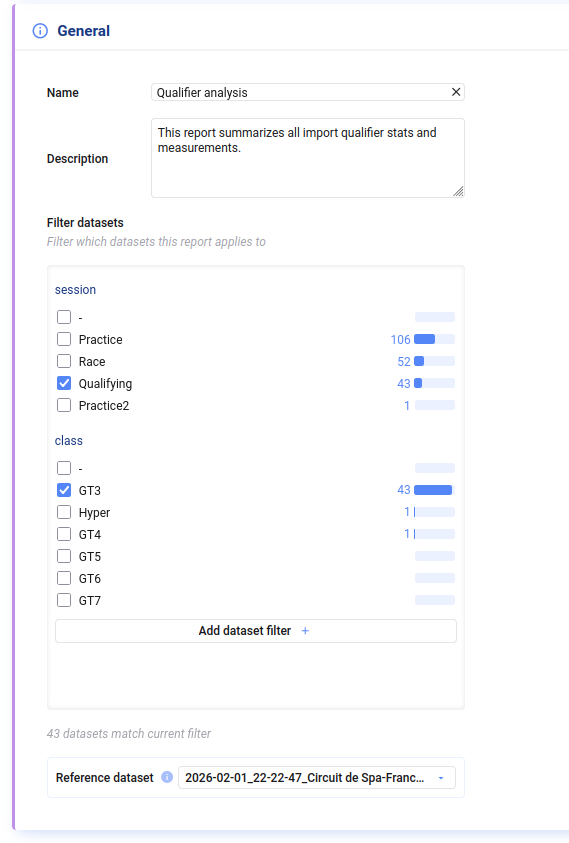
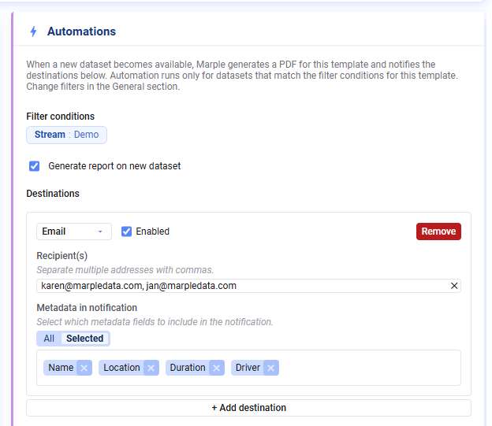
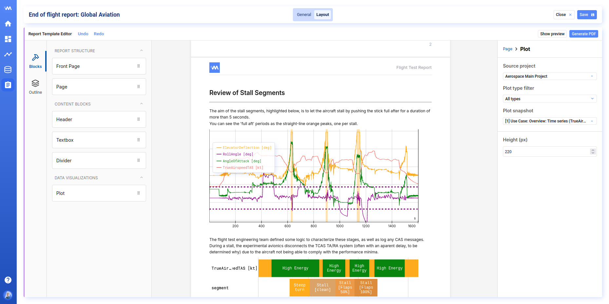
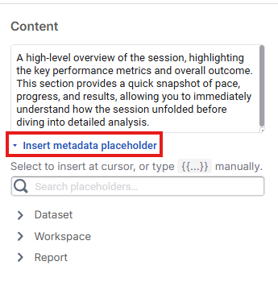
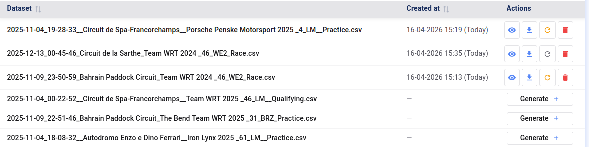

Mit Deepview Reports verwandelt ihr eure Analysen in aufbereitete, teilbare PDF-Dokumente.

Ein Report basiert auf einem **Template**: einem wiederverwendbaren Layout, das ihr einmal entwerft und dann für jeden passenden Datensatz als PDF generieren könnt. Das macht es einfach, konsistente, saubere Reports über Testläufe, Experimente oder Messkampagnen hinweg zu erstellen.

## Key Concepts

### Template

Ein Template legt Struktur und Inhalt eines Reports fest. Es enthält:

- ein **Layout**, das ihr per Drag-and-Drop aus Blöcken (Text, Plots, Trennlinien usw.) aufbaut
- einen **Dataset-Metadata-Filter**, der festlegt, für welche Datensätze das Template gilt
- einen **Referenz-Datensatz**, der zur Vorschau des Reports während der Bearbeitung dient

Templates sind versioniert: Jedes Mal, wenn ihr eine Änderung speichert, wird eine neue Version erfasst, und bereits generierte PDFs werden als veraltet markiert.

### Generated Report

Ein Generated Report ist die **PDF-Ausgabe** eines Templates für einen bestimmten Datensatz. Ihr könnt Reports direkt aus der Reports Library generieren, ansehen, herunterladen und löschen.

## Der Reports-Tab

Der Reports-Tab ist euer Ausgangspunkt. Er listet alle Templates in eurem Workspace auf und bietet schnellen Zugriff auf die aus jedem generierten Reports.

Von hier aus könnt ihr:

- Templates nach Namen **suchen**
- ein neues Template **erstellen**
- ein bestehendes Template **duplizieren** oder **löschen**
- ein Template anklicken, um es zu öffnen und seine generierten Reports zu verwalten

## Ein Template erstellen

1. Klickt im Reports-Tab auf **New report template**.
2. Gebt dem Template einen **Namen** und optional eine Beschreibung.
3. Legt einen **Dataset-Metadata-Filter** fest, um einzugrenzen, für welche Datensätze das Template gedacht ist.
4. Wählt einen **Referenz-Datensatz**, um Plots in der Vorschau zu sehen und ein Test-PDF zu generieren, während ihr am Layout arbeitet.
5. Wechselt zum **Layout**-Tab, um den Report aufzubauen.

## Automations einrichten

Wird ein neuer Datensatz importiert, der dem Dataset-Metadata-Filter eines Templates entspricht, generiert Deepview automatisch einen neuen Report basierend auf diesem Template und Datensatz. Um das abzuschalten, deaktiviert die automatische Report-Generierung in den allgemeinen Einstellungen des Templates.

Ihr könnt ein oder mehrere Ziele konfigurieren, an die der Report sofort nach Erstellung geliefert wird. Unterstützte Ziele:

- **Slack**
- **Microsoft Teams**
- **Email**
- **Custom Webhook**

Einrichtungshinweise findet ihr in den Installationsanleitungen im Automations-Block.

## Das Layout gestalten

Der Layout-Editor ist eine Drag-and-Drop-Fläche. Beginnt, indem ihr einen **Front Page**- oder **Page**-Block auf die Fläche zieht. Der Page-Block nimmt Kind-Blöcke mit dem eigentlichen Inhalt eures Reports auf.

Verfügbare Blöcke:

| Block | Beschreibung |
|---|---|
| Front Page | Deckblatt mit Titel, Untertitel, Autor und Logo |
| Page | Eine Inhaltsseite; dient als Container für die folgenden Blöcke |
| Header | Eine Abschnittsüberschrift (h1–h4) |
| Textbox | Freier Text; jeder Zeilenumbruch wird ein neuer Absatz |
| Divider | Eine horizontale Trennlinie |
| Plot | Ein Snapshot eines Plots aus einem eurer Projects |

### Plots einbetten

Mit dem **Plot**-Block könnt ihr einen Plot direkt aus einem bestehenden Project übernehmen. Wählt das Project, filtert bei Bedarf nach Plot-Typ und wählt den gewünschten Plot aus. Der Block speichert einen Snapshot dieses Plots — Änderungen oder das Löschen eines Plots im Project wirken sich erst nach einem Sync auf euer Template aus. Stimmt der Snapshot in eurem Report nicht mehr mit dem aktuellen Zustand des Plots überein, seht ihr eine Warnung, über die ihr den Snapshot auch erneut synchronisieren könnt. So bleibt euer Template vor unerwarteten Änderungen geschützt.

### Metadata Placeholders

In allen Textkomponenten (Header, Text, Title usw.) könnt ihr Metadata aus eurem Datensatz oder Report verwenden.

Um einen Metadata Placeholder einzufügen, sucht nach dem gewünschten Feld und klickt es an, um es eurem Text hinzuzufügen. Die Metadata des für die Report-Generierung genutzten Datensatzes wird zum Zeitpunkt der Generierung eingesetzt.

## Ein PDF generieren

Sobald euer Template fertig ist:

1. Öffnet das Template im Reports-Tab.
2. Wählt den Datensatz, für den ihr einen Report generieren möchtet.
3. Klickt auf **Generate**.

Deepview rendert den Report serverseitig und speichert das resultierende PDF. Ihr könnt es danach auf derselben Seite **ansehen**, **herunterladen** oder **entfernen**.

Wurde das Template seit der letzten Report-Generierung aktualisiert, wird es mit einem **Refresh**-Hinweis markiert, damit ihr wisst, dass eine neuere Version verfügbar ist.

## Tipps

- **Für Wiederverwendung gestalten.** Die eigentliche Stärke von Templates liegt darin, dasselbe Layout auf viele Datensätze anzuwenden — haltet das Layout allgemein genug, damit es über verschiedene Testläufe hinweg funktioniert, nicht nur für eine einzelne Messung.
- **Wählt einen repräsentativen Referenz-Datensatz**, damit Plots beim Gestalten des Layouts realistisch aussehen.
- **Prüft Plot-Snapshots nach Änderungen.** Aktualisiert ihr ein Project, nachdem ihr ein Report-Template gebaut habt, nutzt die Sync-Option am Plot-Block, um die neueste Version zu übernehmen.
