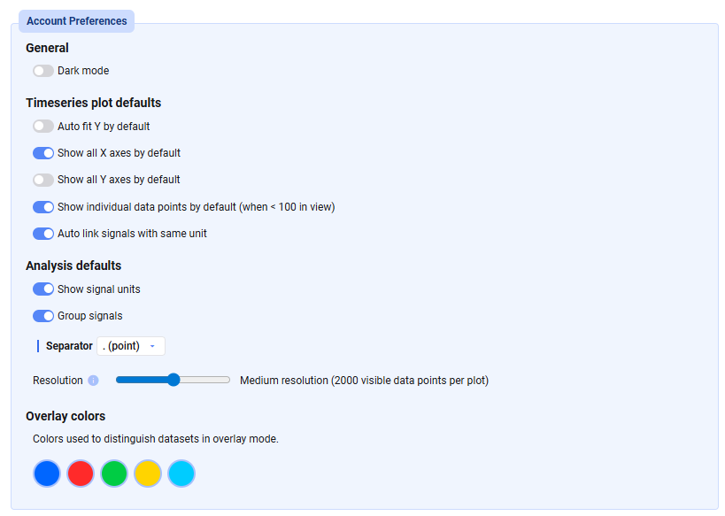

Legt eure persönlichen Einstellungen unter **Settings → Account → Account Preferences** fest:

- **General settings** — Dark Mode ein-/ausschalten
- **Timeseries plot defaults** — Standardeinstellungen für alle neu erstellten Time-Series-Plots
- **Analysis defaults** — Einstellungen für den Analysis-Tab, vor allem bezogen auf die Signal List
- **Overlay colors** — Farben zur Unterscheidung von Datensätzen im Overlay-Modus im Analysis-Tab

