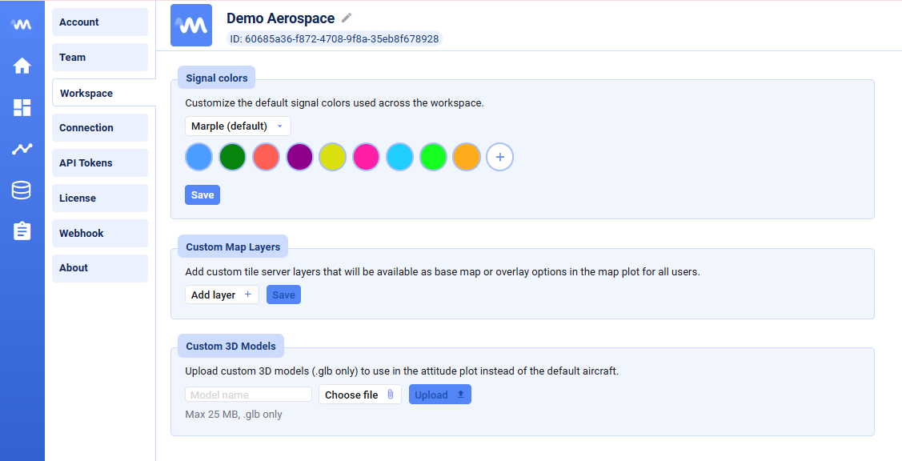

Passt euren Workspace an die Bedürfnisse eures Unternehmens an.

Unter **Settings → Workspace** könnt ihr workspace-weite Standardeinstellungen konfigurieren:

- **Signal colors** — die Standard-Signalfarben, die in allen neuen Plots im Workspace verwendet werden
- **Map layers** — eigene Tile-Server-Layer, die als Basiskarte oder Overlay-Option im Map-Plot für alle Nutzer verfügbar sind

