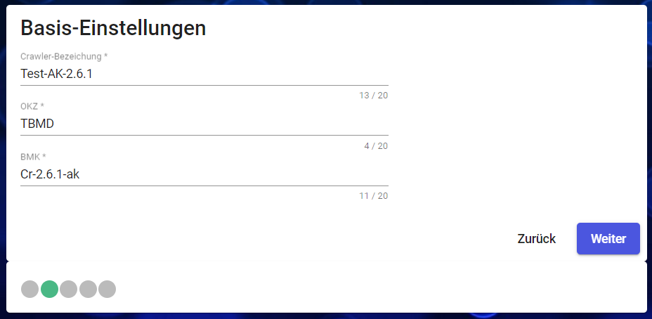
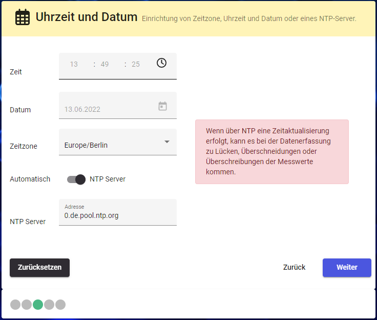
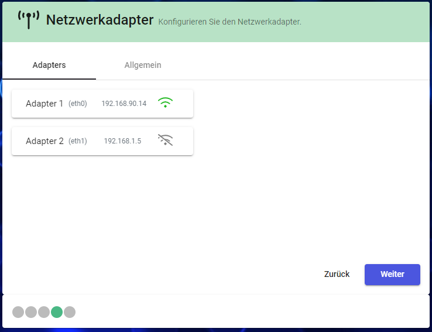
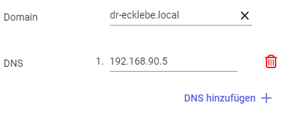
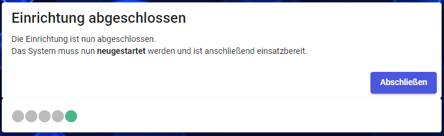

In dieser Anleitung finden Sie Informationen für die Erst-Einrichtung des Edges. Mithilfe eines Wizards werden Sie durch mehrere Schritte geleitet. Erst nach Abschluss des Wizards ist der Edge-betriebsbereit.

:::caution
💡  Bitte beachten Sie, dass nach dem Abschluss der Wizard der Edge neu   gestartet werden muss. Dies kann wenige Minuten in Anspruch nehmen.
:::

---
# Verbindung mit dem Edge herstellen

:::tip
🌏 💻  Der Zugriff auf den Edge erfolgt mit dem **Browser**. 
*           Es wird empfohlen Chrome, Edge oder Firefox zu nutzen.*
:::

Um Verbindung mit dem Edge aufzubauen, muss man über das Netzwerk verbunden sein. Bei Auslieferung oder nach dem Zurücksetzen auf Werkseinstellungen werden die IP-Adresse auf Standard-Werte gesetzt:

- X1: 192.168.0.5
- X2: 192.168.1.5

Ist der Edge in einem anderen Subnetz, kann das *Discovery-Tool* behilflich sein. Dieses ermöglicht den X1 Adapter zu konfigurieren, sodass im Anschluss direkt auf die Web-Oberfläche zugegriffen werden kann.

---
# Einrichtungs-Wizard

Mit dem Wizard wird die Erst-Konfiguration des Edge-Systems vorgenommen. Diese Vorgang wird nach einem Zurücksetzen des Edges erneut erforderlich.

---
## Sprache

- Auswahl der Sprache
- aktuelle Auswahl-Möglichkeiten: Deutsch und Englisch
- Hinweis: Diese Einstellung ist nur lokal im Browser, nicht Nutzer-Übergreifend
- kann später geändert werden: ja

---
## Bezeichnung und Orts-Kennzeichen

- erfordeliche Angaben:
  - Name = Bezeichner im Netzwerk, in der Anzeige, und im Gateway 
    -  ⚠ kann später **nicht** geändert werden (zurücksetzen auf Werkseinstellungen erfoderlich)
    - Längen-Beschränkung: max. 20 Zeichen 
      *(es wird empfohlen, keine Sonder- und Leerzeichen zu verwenden)*
  - OKZ / BMK = freie Angaben, dienen der Zuordnung
    - kann später geändert werden
    - können u.u. bei Funktionen zur Daten-Weiterleitung verwendet werden

---
## Sicherheit

Im nächsten Schritt ist das Passwort für den Einstellungsbereich im Edge zu setzen. Dieses Passwort kann später geändert werden.

:::note
- Das Passwort muss eine Länge von mind. 6 Zeichen haben.
- Für den Login wird der Benutzer “admin” und das hier bei der Einrichtung gesetzte Passwort benötigt.
:::

---
## Uhrzeit und Datum

### Allgemein

- Manuell und automatisch (NTP-Server) wird unterstützt

Modus kann umgeschaltet werden 

- Angabe der Zeitzone (Auswahl aus Liste)

### Automatisch (per NTP-Server)

- automatische Synchronisation (Intervall???)
- Nutzung des angegebenen Servers, kann geändert werden
- Voraussetzung: Server kann vom Edge erreicht werden (egal, welche `LAN-Adapter`)

### Manuell

- umstellen auf „manuell“
- Uhrzeit und Datum können händisch angegeben werden
- Uhrzeit bezieht sich auf die ausgewählten Zeitzone

---
## Netzwerk-Einstellungen

- es gibt, je nach Gerät, mehrere Netzwerkadapter
- Jeder Adapter hat eine voreinstellte IP bei der Auslieferung bzw. nach einem Zurücksetzen auf Werkseinstellungen
- Je nach Hardware-Variante, z.B. WAGO oder Siemens, sind Netzwerkadapter am Gerät mit X1 (=eth0) und X2 (=eth1) bezeichnet.

                                                        

::::VerticalSplit{layout="middle"}
:::VerticalSplitItem
**Siemens:** 

:::

:::VerticalSplitItem
**WAGO:**

:::
::::

**                                                                 **

Bei dem Einsatz als VM kann es zu Abweichungen bei der Anzahl der Netzwerkadapter kommen.

---
### Adapter

- für jeden Anschluss/Adapter kann eingestellt werden:
  - IP-Adresse
  - Subnetz-Maske
  - Standard-Gateway
  - de-/aktivieren von DHCP

### DNS + Domain

- Zusätzlich kann Adapter-übergreifend die Domain und DNS angegeben werden
- alle Angaben sind optional
- es können bis zu 5 DNS angegeben werden
- einzelne DNS können gelöscht werden

---
## Abschließen

Die Erst-Einrichtung ist abgeschlossen. Mit Drücken des „Abschließen“ Buttons wird der Edge neu gestartet. Es kann anschließend mit der Einrichtung der Datenaufzeichnung fortgesetzt werden.
