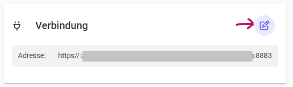
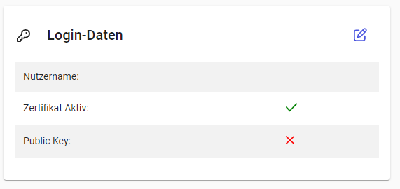
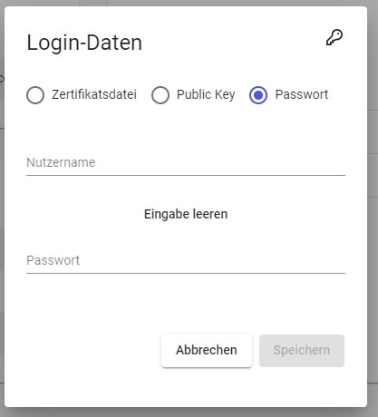
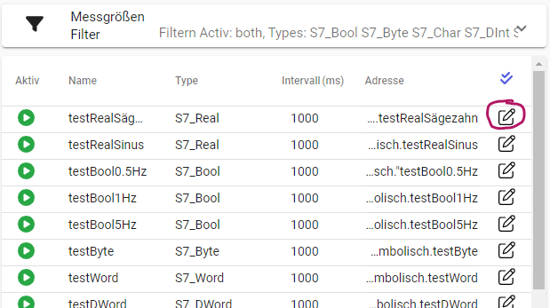

:::note
Diese Funktion ist mit dem hinzubuchbaren **NuP Gateway Modul** verfügbar. 
Sprechen Sie uns gerne an.
:::

Neben der lokalen Aufzeichnung auf dem Edge-System können diese Daten auch an andere Systeme, wie die N+P-Plattform, übertragen werden. Im Folgenden wird beschrieben, wie die Konfiguration auf dem Edge durchgeführt werden muss, um die Kommunikation mit der Plattform herzustellen und ausgewählte Messwerte zu übermitteln.

# Voraussetzung

Damit der Edge mit der N+P-Plattform kommunizieren, muss zunächst die Funktionen im Gateway installiert worden sein. Dies kann bereits bei der Auslieferung erfolgt sein oder muss nachträglich mit einem Update-Paket erfolgen.

Im erweiterten UI für Einrichtungen wird in der unteren linken Ecke die Version des Edges angezeigt. Befindet sich im Namen “-nup1.x” (x kann je nach Version variieren) so wurden die nötigen Funktionen und Dienste bereits installiert. Andernfalls ist das passende Update-Paket, z.B. “update-2.12.2-nup1.1” zu installieren.

# Einrichtung Kommunikation (einmalig)

1. **BMK **&#x73;etzen:
   - Klicken Sie im Bereich „System“ → „Einstellungen“ auf die Fläche “Allgemein”
   - Geben Sie als BMK den für die Cloud definierten Namen des Edges ein
   - Klicken Sie auf speichern
2. Im Bereich „System“ → „Gateway“ den NuP Endpoint (crawler-app-gateway-endpoint.nup) auswählen. Hier sind folgende Einstellungen vorzunehmen:
   - **Adresse **&#x65;instellen: 
     - Klicken Sie im Bereich “Verbindung” auf das Stift-Symbol oben rechts.

:::Paragraph{listStyleType="lower-roman" indent="2"}
In dem sich öffnenden Dialog passen Sie das Protokoll, die Adresse, den Port an (z.B. mqtt, *plattform.nupis-rz.de*, 8883).
:::

:::Paragraph{listStyleType="lower-roman" listStart="2" indent="2"}
Klicken Sie auf “Speichern”.
:::

- **Benutzername **&#x75;nd **Passwort **&#x61;ngeben
  - Klicken Sie im Bereich “Login-Daten” auf das Stift-Symbol oben rechts.

- Wählen Sie hier die Methode „Passwort“ aus.

- Geben Sie die Ihnen zur Verfügung gestellten Informationen zu Nutzername und Passwort ein.
- Speichern Sie die Eingaben

Nach diesen Schritten wird die Verbindung zur Plattform hergestellt und der Verbindungsstatus wird angezeigt. Dies kann je nach Umständen einige Sekunden dauern.

:::note
ℹ Wurde die BMK nach der Einrichtung der Adresse oder der Benutzer-Daten geändert, muss aktuell erneut im Dialog für die Adresse auf „Speichern“ geklickt werden. Ansonsten wird die geänderte BMK vom System nicht übernommen.
:::

# Einrichten der Messgrößen

Sobald die Kommunikation zur Plattform erfolgreich eingerichtet wurde, können Sie Messgrößen nach Bedarf für die Übertragung einrichten. Vorher sollten jedoch die Messgrößen für die Datenaufzeichnung im Edge konfiguriert worden sein. Weitere Informationen dazu finden Sie unter: How-To: Einrichtung der Datenaufzeichnung.

Die Konfiguration der Messgrößen für die Übertragung erfordert sowohl die Auswahl im Gateway-Bereich als auch die Hinzufügung von Parametern/Tags. Die Reihenfolge ist dabei beliebig. Beachten Sie, dass Messgrößen ohne erforderliche Parameter bei der Übertragung ignoriert werden.

### Auswählen im Gateway

1. Wechseln sie über “System” → “Gateway” → “NuP Endpoint”. Im rechten Bereich sehen Sie eine Liste von Erweiterungen. Wählen Sie 'NuP Dispatcher' aus. 
2. Auf der folgenden Seite können Sie über den **“+”-Button** einzelne oder mehrere Messgrößen zur Übertragung hinzufügen. Diese Auswahl erfolgt aus den zuvor im Edge konfigurierten Messgrößen. Navigieren Sie durch die Struktur und wählen Sie die gewünschten Messgrößen aus.
3. Bestätigen Sie Ihre Auswahl über den **Einkaufswagen **(oben rechts). Anschließend müssen Sie entscheiden, ob Sie die Messwerte in ihrer **originalen Auflösung** oder **aggregiert **&#xFC;bertragen möchten. Diese Einstellung kann später für jede Messgröße angepasst werden.

Die ausgewählten Messgrößen für die Übertragung werden in der Übersicht des NuP Dispatchers aufgeführt. Hier haben Sie die Möglichkeit, Messgrößen zu entfernen oder die Aggregationseinstellungen anzupassen.

### Einstellung erforderlicher Parameter

Die N+P-Plattform erfordert die Angabe verschiedener Einstellungen für jede Messgröße, die in die Cloud übertragen werden soll. Diese Informationen umfassen:

- Name der Messgröße in der Cloud
- Einheit der Messwerte
- Zuordnung zur Anlage

Diese Informationen müssen für jede Messgröße separat hinzugefügt werden. Um dies zu tun, wechseln Sie in den Bereich “**Alle Messgrößen”**. Navigieren Sie zu den entsprechenden Messgrößen und öffnen Sie den Einstellungsdialog, indem Sie auf das **Stift-Symbol** rechts neben der jeweiligen Messgröße klicken.

In dem Dialog klicken sie unter “Parameter” auf die Schaltfläche **“+ Information hinzufügen”**. Wiederholen Sie diesen Schritt, bis gena&#x75;** 3 Zeilen** hinzugefügt wurden. Füllen Sie die Felder wie folgt 

| **Bezeichner**        | **Wert**                                   |
| --------------------- | ------------------------------------------ |
| **nupName**           | Namen der Messgröße in der Cloud-Plattform |
| **nupUnit**           | Einheit der Messwerte                      |
| **nupIdentification** | Zugeordnete Anlage (in der Cloud)          |

Falls Ihnen ein Tippfehler bei einem Bezeichner unterlaufen ist, können Sie die betreffende Zeile einfach löschen und eine neue hinzufügen.

Vergessen Sie am Ende nicht, Ihre Änderungen zu speichern. Diese werden im **nächsten Übertragungszyklus **&#x62;ei der Übertragung berücksichtigt.
