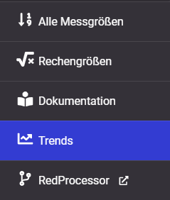
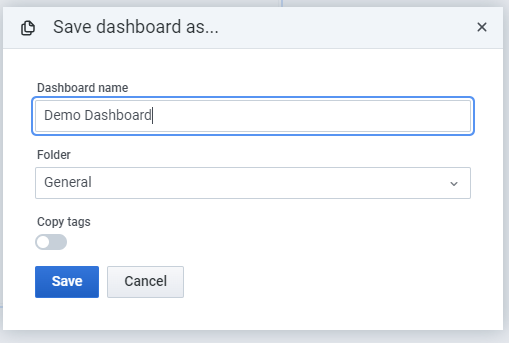
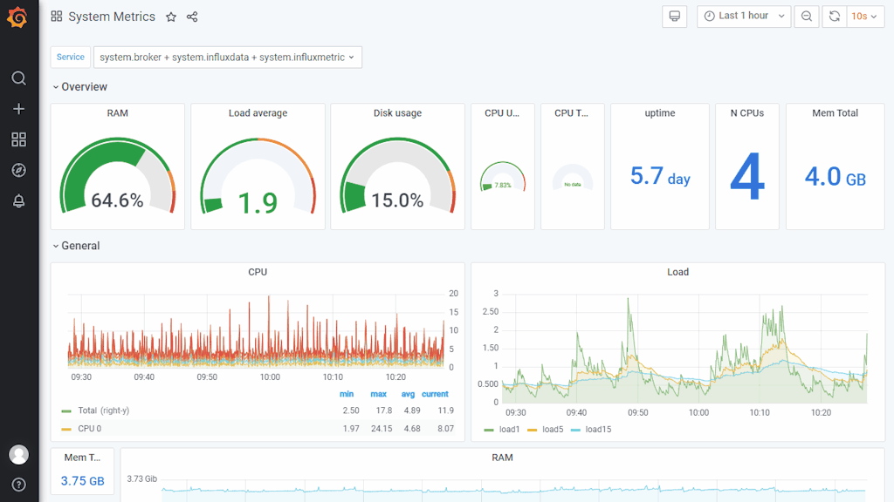
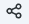
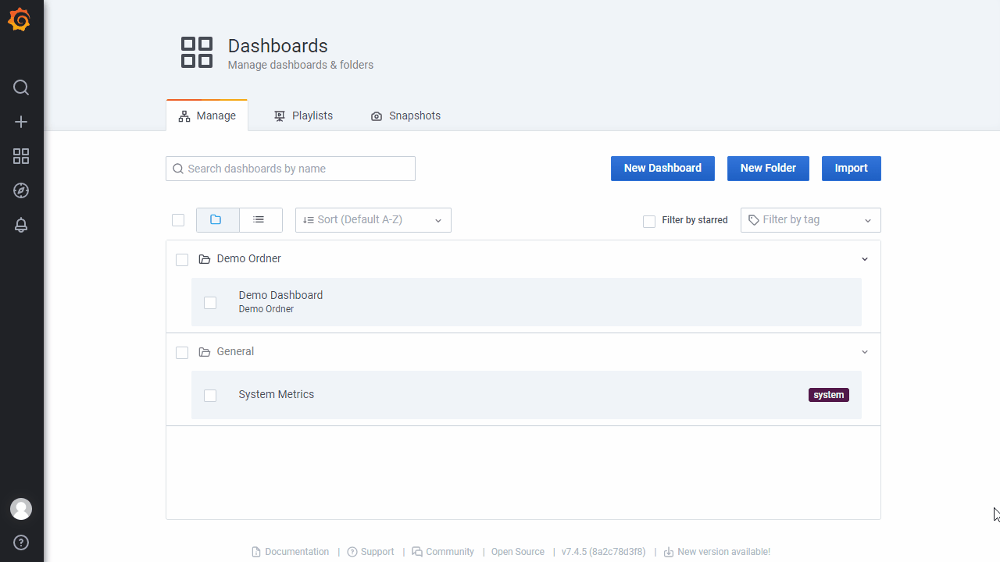
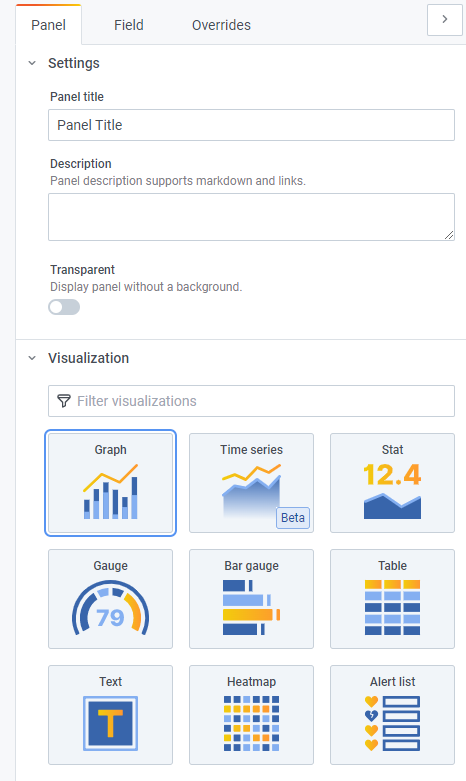

:::tip
 Gültig ab Edge Version = **2.7.1**
:::

## Allgemeine Informationen zur Visualisierung (Grafana)

::::VerticalSplit{layout="right"}
:::VerticalSplitItem
- Für die Visualisierung der Messwerte und anderer Daten wird die Visualisierungsplattform “Grafana” genutzt.
- Diese bietet vielseitige Möglichkeiten Daten darzustellen
- Je nach Datenpunkte und Use Case stehen diverse Anzeigemöglichkeiten zur Verfügung
- In Dashboard können mehrere Panels eingerichtet werden
- Jedes Panel kann mehrere Messgrößen umfassen und individuell eingestellt werden.
- Tutorials und allgemeine Tipps & Trick zu Grafana
  - [Grafana documentation | Grafana documentation ](https://grafana.com/docs/grafana/v7.4/)
  - [Tutorials | Grafana Labs](https://grafana.com/tutorials/)                                               
  - [Tips for Designing Grafana Dashboards](https://www.percona.com/blog/designing-grafana-dashboards/) 
  - …
:::

:::VerticalSplitItem

:::
::::

:::note
ℹ Im Edge wird Grafana mit der Version 7.4 eingesetzt.
:::

---
## Viewer vs. Editor

Für die Anzeige zuvor eingerichteter Dashboards ist keine Anmeldung erforderlich. Möchten sie neue Dashboards oder Panels erstellen oder bestehende bearbeiten müssen Sie sich mich einem “Editor” Account einloggen.

Zum Einloggen gehen Sie auf das Symbol im unteren linken Bereich. Sie werden anschließend nach einem `Nutzernamen und einem Passwort` gefragt.

## Dashboards erstellen

::::VerticalSplit{layout="right"}
:::VerticalSplitItem
Zum Erstellen eines neuen Dashboards klicken Sie in der linken Menü-Leiste auf “+”-Symbol und Wählen “Dashboard” aus. Eine Seite mit einem blanken Panel wird geöffnet.

Sie können nun Inhalte dem Dashboard hinzufügen und erweitere Einstellungen vornehmen.
:::

:::VerticalSplitItem

:::
::::

:::::VerticalSplit{layout="middle"}
:::VerticalSplitItem

:::

::::VerticalSplitItem
:::caution
Damit das Dashboard dauerhaft existiert, muss dieses zunächst **gespeichert **&#x77;erden. Klicken Sie hierzu auf das 💾 -Symbol im oberen rechten Bereich.

In dem sich öffnenden Dialog können Sie dem Dashboard einen Namen geben (kann später geändert werden) und dieses in einen Ordner sortieren. Klicken Sie anschließend auf “Save”.
:::
::::
:::::

### Anlegen von Ordnern

Ordner dienen der Sortierung von Dashboards. Sie können beliebig viele Ordner erstellen und Dashboards diesen zuordnen.

::::VerticalSplit{layout="middle"}
:::VerticalSplitItem
Zur Erstellung eines Ordners klicken Sie im linken Menü auf das “+”-Symbol und wählen Sie im Untermenü “Folder” aus. 

Geben Sie den gewünschten Namen für den Ordner an und bestätigen mit “Create”.
:::

:::VerticalSplitItem

:::
::::

### Ex-/Import von Dashboards

Sie können Dashboards exportieren und diese auf einem anderen Gerät oder zur Wiederherstellung importieren werden.

::::VerticalSplit{layout="left"}
:::VerticalSplitItem

:::

:::VerticalSplitItem
Öffnen Sie ein Dashboard, welches Sie **exportieren **&#x6D;öchten. Klicken Sie im oberen linken Bereich auf das “Share”-Symbol (neben dem Titel) und wählen die Option “Export” aus. Mit “Save to file” laden Sie das Dashboard (Einstellungen und Panels) als Datei herunter.
:::
::::

Um ein exportiertes Dashboard zu **importieren**, klicken Sie zunächst auf das “+”-Symbol im linken Menü und wählen “Import”. Im folgenden Dialog können Sie die Dashboard-Datei (Datei-Endung = .json) auswählen. Sie können nun den Namen, den Ordner und die UID des Dashboards ändern. Sollte es bereits ein Dashboard mit gleichem Namen oder UID geben, müssen die entsprechenden Informationen angepasst werden. Sie können auch das bestehende Dashboard überschreiben.

## Inhalt einem Dashboard hinzufügen

Ein Dashboard besteht hauptsächlich aus sogenannten Panels. Diese können individuell erstellt und eingestellt werden.

::::VerticalSplit{layout="left"}
:::VerticalSplitItem

:::

:::VerticalSplitItem
Um ein neues Panel anzulegen, klicken Sie auf das “+”-Symbol im oberen rechten Bereich (links neben dem Speichern-Symbol).
:::
::::

Ein neues Panel wird immer oben eingefügt, kann dann anschließend individuell im Dashboard platziert werden. Wählen Sie in der hinzugefügten Box “+ Add new panel”. Sie werden auf die Editor-Seite für ein Panel geleitet. Dieser Bereich ermöglicht die Konfiguration der Datenquelle und der Anzeige.

### Messgröße auswählen

Damit Daten in einem Panel angezeigt werden können, muss mindestens eine Messgröße ausgewählt werden. Dies erfolgt im unteren Bereich, unterhalb der Vorschau für die Anzeige.

1. **Select Measurement***:* wählen Sie hier source aus. Sollte dies nicht zur Wahl stehen, wurden noch keine Werte zu eingerichteten Messgrößen aufgezeichnet. Möchten Sie dennoch die Visualisierung einrichten, können Sie source auch manuell eingeben (beachten sie die Kleinschreibung).

2. **Feld-Gerät wählen**: Klicken Sie auf das “+”-Symbol rechts neben “WHERE” und wählen “device\_name”. Klicken Sie anschließend auf “select tag value” und wählen das gewünschte Gerät aus.

3. **Ordner wählen**: Zum Selektieren einer Messgröße muss zunächst der Ordner, in dem die Messgröße angelegt wurde, ausgewählt werden (siehe How-To: Hinzufügen von Messgrößen, How-To: Bearbeiten eingerichteter Messgrößen). Klicken Sie hierzu erneut auf “+”-Symbol und wählen “group\_\*”. Klicken Sie anschließend auf “select tag value” und wählen den gewünschten Ordner aus. Wiederholen Sie diese Schritte, bis Sie in dem Ziel-Ordner angekommen sind.

4. **Messgröße wählen**: Klicken Sie erneut auf das “+”-Symbol und wählen “variable” aus. Wählen Sie aus der Liste die gewünschte Messgröße aus. Sie können durch Text-Eingabe die Auswahl filtern.

Insofern für die ausgewählte Messgröße bereits Werte in dem aktuellen Zeitbereich aufgezeichnet wurden, sollten diese im Vorschau-Bereich anzeigt werden.

:::caution
Wurde die Auswahl der Messgröße noch nicht vollständig abgeschlossen (z. B. wurde nur das Gerät ausgewählt), werden bereits Werte in der Vorschau angezeigt. Diese sind nicht korrekt und entsprechen einer Kombination von mehreren Messgrößen. Es ist daher entscheidend, am Ende eine Messgröße (“variable”) ausgewählt zu haben.
:::

### Messgrößen vom Typ “String”

::::VerticalSplit{layout="right"}
:::VerticalSplitItem
Messgrößen, welche im Edge als String gespeichert werden `(z.B. S7_DWORD`, siehe *Spezifikation: Protokolle und Feldgeräte*) erfordern eine Änderung des Wert “field”. Klicken Sie hierzu auf “value” im Bereich “Select”. Geben Sie den Text `“stringValue” `ein (⚠ beachten Sie die Groß-/Kleinschreibung). 
:::

:::VerticalSplitItem

:::
::::

### Anzeigetyp (“Visualization”) ändern und anpassen

::::VerticalSplit{layout="left"}
:::VerticalSplitItem

:::

:::VerticalSplitItem
Grafana bietet diverse Darstellungsmöglichkeiten bereit. Diese sind u.a. Diagrammen (Linien, Balken), einzelne Werte, Gauges oder Tabellen. Je nach Darstellung können unterschiedliche Einstellungen (Achsen, Legende, Farben, Bezeichner) vorgenommen werden. Es sei hier auf die offizielle *Dokumentation *&#x75;nd *Tutorials *&#x76;on Grafana verwiesen.

Alle Einstellungen können im rechten Bereich vorgenommen werden.
:::
::::
