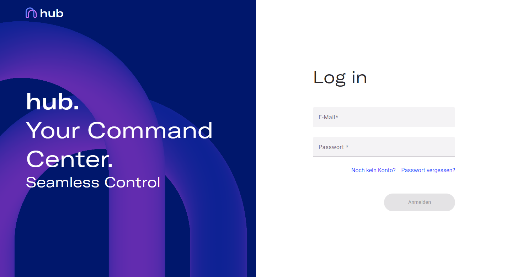
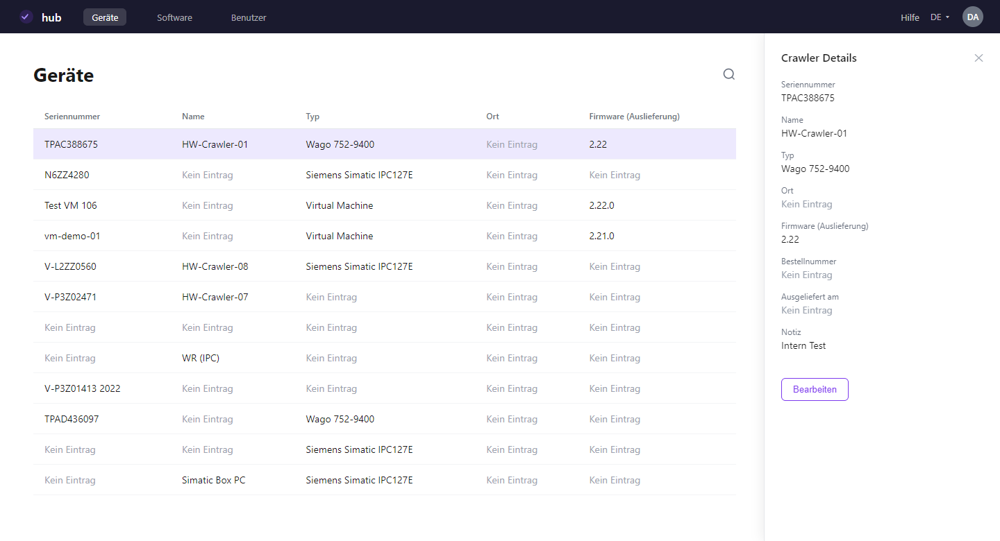

Crawler.Hub ist eine webbasierte Management-Plattform für registrierte Edge (Crawler)-Geräte. Nutzer behalten den Überblick über alle Geräte, Firmware-Versionen und Software-Downloads — ohne direkten Gerätezugriff. Zugriff und Sichtbarkeit richten sich nach der zugewiesenen Rolle.

  

## Funktionsumfang

Jeder Account hat eine Rolle — entweder **User** oder **Admin**. Admins können zusätzlich neue Benutzer innerhalb ihrer Organisation anlegen und Rollen vergeben.

  

User

  

    
Geräte

    
Übersicht aller registrierten Edge (Crawler)-Geräte mit Seriennummer, Name, Typ, Ort und Firmware-Version. Ein Klick öffnet die Detailansicht.*

  

  

    
Software

    
Aktuelle und ältere Firmware- sowie Companion-App-Versionen auf einen Blick. Je Version sind neue Features aufgelistet, inklusive Links zu Dokumentation, Changelog und Download.

  

  

    
Kontoeinstellungen

    
Persönliche Daten bearbeiten (Name, E-Mail-Adresse) und Passwort ändern.

  

* Name, Ort, Bestellnummer, Lieferdatum und Notiz können in der Detailansicht bearbeitet werden.

Admin

  

    
Benutzerverwaltung

    
Benutzer per E-Mail einladen, Rollen zuweisen (Admin oder User) und Zugänge innerhalb der Organisation verwalten.

  

## Sicherheitshinweise

  

    
Session-Timeout

    
Hub meldet Sie nach einer Inaktivitätsphase automatisch ab. Melden Sie sich auf gemeinsam genutzten Computern immer manuell ab.

  

  

    
Zwei-Faktor-Authentifizierung

    
Hub verwendet E-Mail-basierte Bestätigungscodes beim Login.

  

  

    
Rollenbasierter Zugriff

    
Ihr Zugriff ist auf die Funktionen beschränkt, die Ihrer Rolle zugewiesen sind.

  

  

    
Nur HTTPS

    
Hub ist ausschließlich über eine verschlüsselte HTTPS-Verbindung erreichbar.

  

