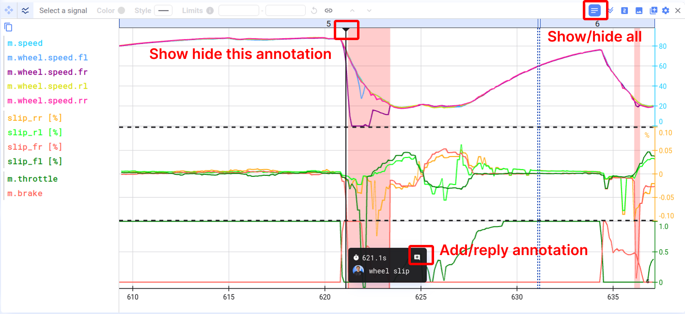

Add annotations to your data to make analysis and collaboration easier. Annotations added to a data set are visible across all projects and can be viewed by every user in your workspace. To get started, hover over a plot, place your cursor at the desired timestamp, and create a new annotation.

