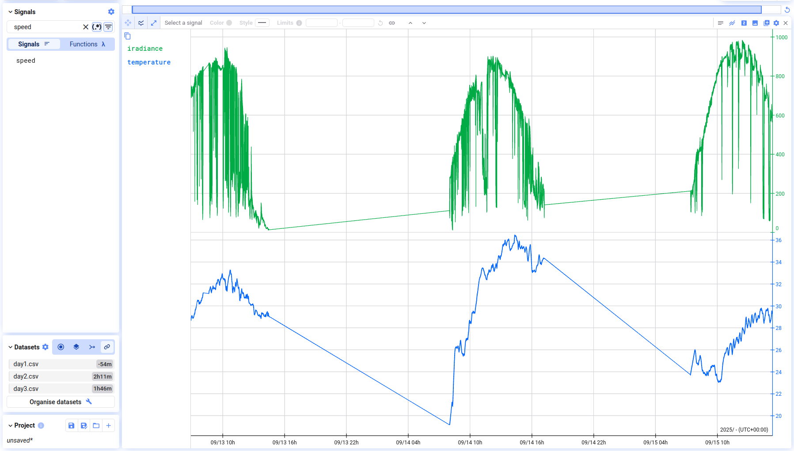
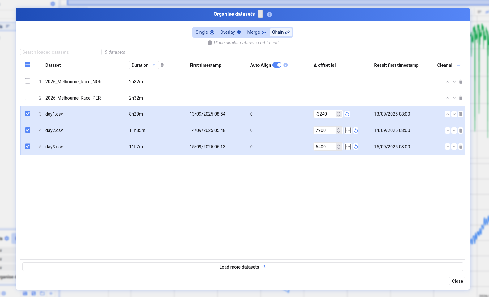
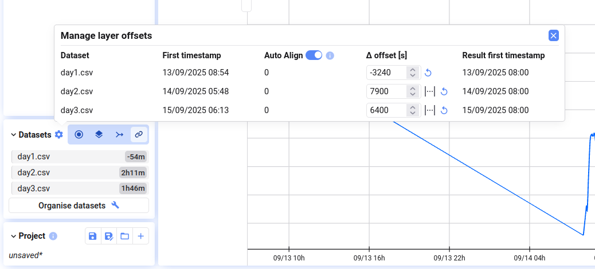

If you have several consecutive recordings — for example, a recording split into multiple files, or several runs of the same test — Chain places them end-to-end on the time axis so they appear as one continuous timeline.

## Enable chain

Choose **Chain** in the dialog when visualizing multiple data sets, or switch to it at any time from the **Datasets** dialog (bottom-left of the tab). Your data sets are now placed end-to-end, so you can scroll through them as a single uninterrupted measurement.

## Select and order data sets

Open **Organise datasets** (button in the Datasets dialog, or press <kbd>i</kbd>). In Chain mode, each data set has a checkbox — tick the ones to include, and reorder them with the arrows on the right. Their order determines the order they appear in along the time axis.

## Configure the time axis

- **First timestamp** — the original start time of the data set
- **Auto-align** — chains relative-timestamp data sets end-to-end automatically; absolute-timestamp data sets keep their original positions
- **Delta offset** — additional offset in seconds to add or remove a gap between two recordings; you can also use the distance between two cursors to set this visually
- **Result first timestamp** — the start time of the data set after all offsets are applied

Set offsets via the gear button next to **Datasets**, or in the **Organise datasets** dialog.

{/* UNMATCHED extra screenshot found on live page, no marker to replace */}

