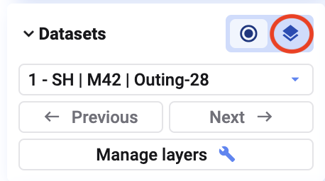
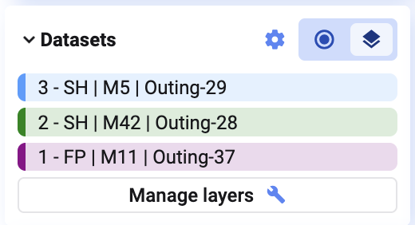
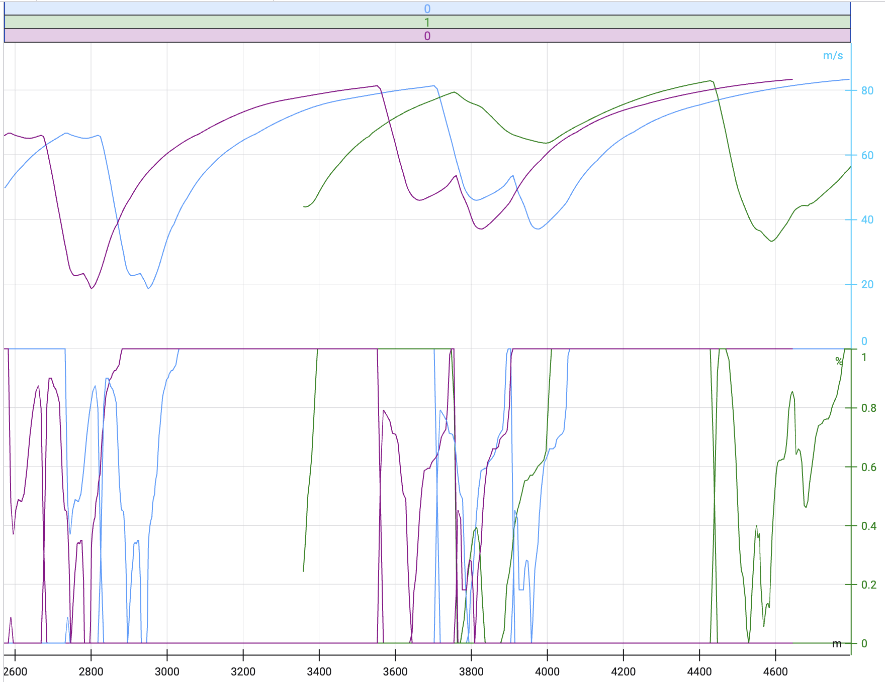
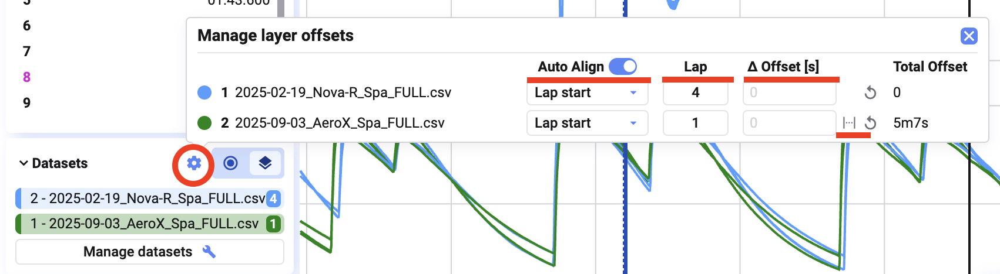
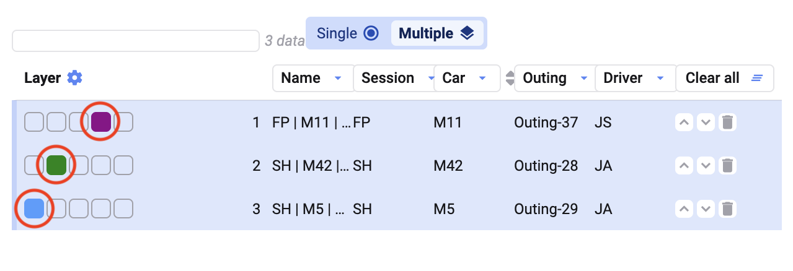

Overlay lets you visualize multiple data sets at once to compare them.

## Enable multiple layers

Click the multiple-layers icon in the datasets dialog (bottom-left of the tab) to show all data sets loaded in the project.

Each data set is then assigned a color.

For example, the first data set in blue, the second in green, the third in purple.

## Configure overlay

Click the settings wheel in the Datasets dialog to configure how data sets align:

- **Adjust dataset alignment** so data points match up correctly across data sets
- **Compare a specific run** by selecting a reference data set
- **Set an offset** between two data sets to align time or event markers — you can also use the second cursor to set this offset visually (see [Cursors](/deepview/analysis/plot-types/time-series/cursors#placing-a-secondary-cursor))

## Manage Datasets dialog

Click **Manage Datasets** in the **Datasets** dialog (bottom-left) to customize how data sets or layers are displayed. Click an empty color box next to a data set or layer to assign it a new color, and use the arrows on the right to reorder data sets.

