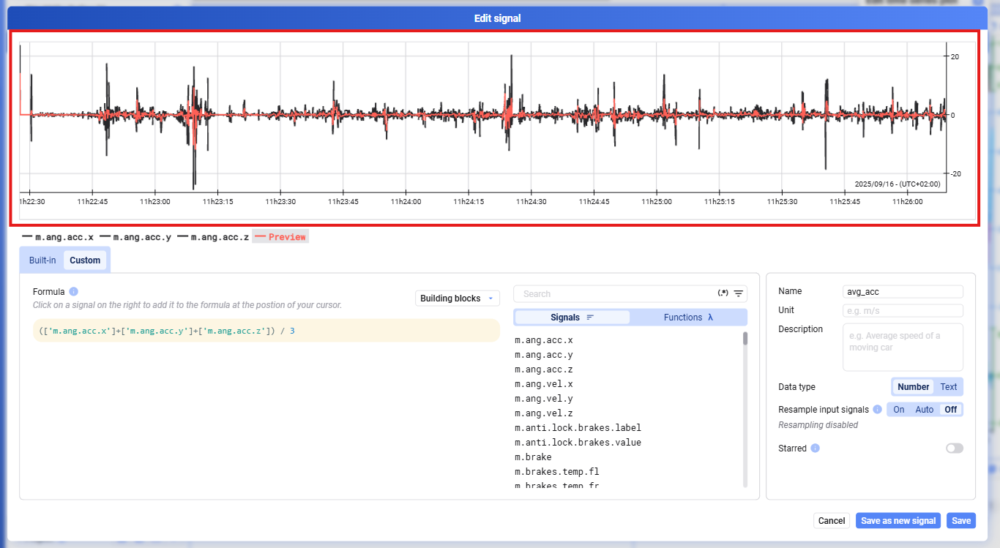
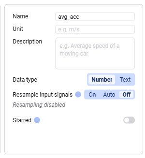
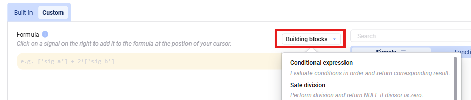

Custom functions use PostgreSQL syntax. Enclose signal names in brackets and quotes, e.g. `['SignalName']` — you can also search for a signal on the right and click its name to insert it directly into your formula.

A preview of the resulting signal is shown in red in the preview window.

On the right, you can configure:

- **Name**, **Description**, **Unit**
- **Resample** the input signal's time base, to combine signals with different time bases in the same function — see [Resampling](/deepview/analysis/resampling)
- **Star** the function so it also appears for other users in your workspace by default (unstarred functions are only shown to the user who created them)

Any function available in PostgreSQL can be used. A set of building blocks is provided for common cases — click one and fill in the signals or expressions it needs.

