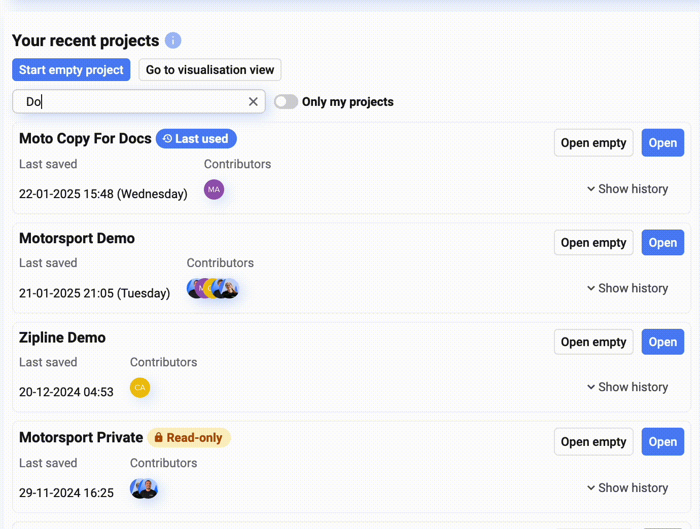
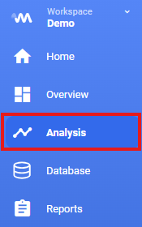
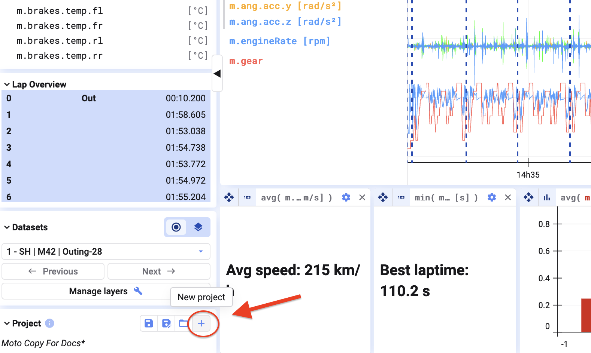

## Open an existing project

1. From the home screen, find the project you want in the project list
2. Select the data you want to visualize
3. Click **Open with selected data**

## Start a new project

To start fresh, click **New Project** in the bottom-left corner. This opens an empty project with no plots — see [Add Data Sets](/deepview/analysis/add-data-sets) for how to load data into it.

For background on what a project actually is (and how it differs from a single visualization), see [Projects](/deepview/projects).

{/* UNMATCHED extra screenshot found on live page, no marker to replace */}

