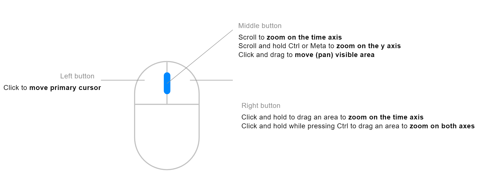
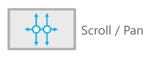

## Mouse actions

With the mouse, you can do most of the data manipulations needed in the visualization view.

- **Double click** — reset zoom
- **Left click** — set/move the cursor
- **Right click + drag** — zoom to selected time range
- **Right click + drag + Ctrl** — zoom to selected square
- **Middle button + scroll** — zoom on the time axis
- **Middle button + scroll + Ctrl** — zoom on the y-axis
- **Middle button + pan (left/right)** — pan the time axis
- **Swipe vertical** — zoom plot range
- **Swipe horizontal** — pan

## Touchpad

Deepview can be used with a laptop's touchpad.

To zoom in/out in time, slide up and down with two fingers on the touchpad. Move left and right to pan in time.

- **2-finger up/down** — zoom in time
- **2-finger left/right** — pan in time (left/right)
- **Swipe vertical** — zoom plot range
- **Swipe horizontal** — pan

## Add and remove cursors

- **Left click** — add cursor at mouse position
- **Space** — add a second cursor at mouse position
- **Esc** — remove cursors

{/* UNMATCHED extra screenshot found on live page, no marker to replace */}

