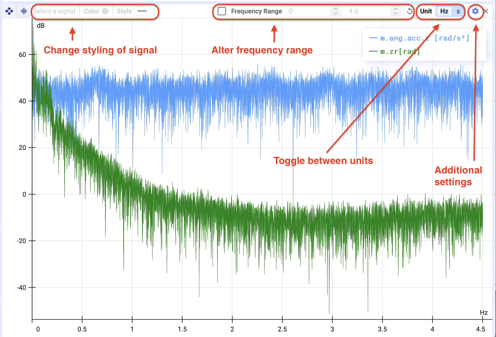
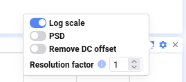

The Frequency plot behaves and looks similar to the Time Series plot.

It uses FFT to plot the selected time range in the frequency domain. Deepview assumes a constant sampling rate and no missing data points — otherwise the plot may not be entirely accurate.

## Toolbar

### Change signal styling

You can change the color or stroke style of the signals in the plot.

### Frequency range

You can set the frequency range of the plot. You can also zoom in by clicking and dragging with your right mouse button (making a selection), just as in the Time Series plot.

### Toggle between units

You can change the unit of the x-axis. Note that this mirrors the plot.

## Additional settings

Behind the settings wheel, there are three additional settings you can toggle on and off.

### Change scale

Turn this on to change the y-axis scale to logarithmic. The default is a linear scale.

### PSD (Power Spectral Density)

Turn this on to show the plot as a power spectral density plot — useful for analyzing random or noisy signals where energy is spread out over many frequencies.

The default display of the FFT plot is amplitude.

### Remove DC offset

Remove the direct current (DC) component, or the signal's zero-frequency component, from the plot.

### Resolution factor

This value sets the number of neighboring points averaged together in one frequency bin. Increase it to average neighboring frequency bins together, smoothing the frequency domain.
