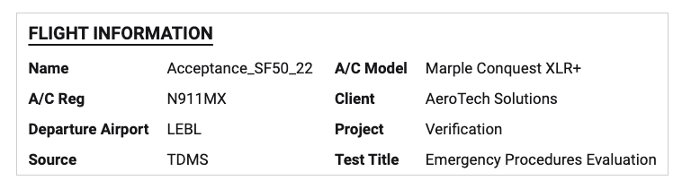

The **Metadata Plot** shows the metadata of the currently open data set — useful to know exactly what information is attached to it.

You can also use the Metadata Plot within other Deepview tooling, like Reports or [Export image](/deepview/analysis/export-image). It can show two types of text:

- **Metadata** — dynamically changes according to the metadata in your data set, e.g. machine, operator, test name
- **Static text** — stays the same, and changes according to the project you have open, e.g. project name, verification phase, main editor

## Settings

Accessible via the settings wheel at the top-right of the plot:

- **Title** — default is "Metadata Plot"
- **Columns** — has an "Auto" toggle, or a manual number entry
- **Box** — show the Metadata Plot in a boxed visual format
- **Field & Value** — item-specific settings; from here, you can e.g. edit the text on a static text entry
- **Add + buttons** — add a new row of either metadata or static text

