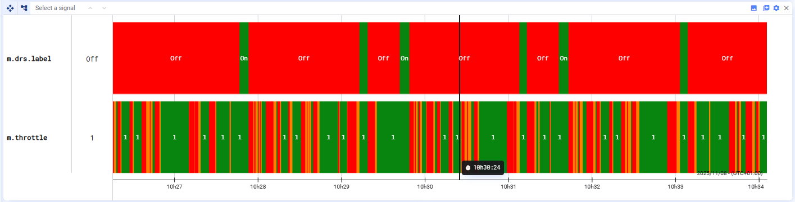
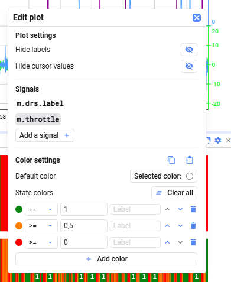

State plots display the state of one or more signals over time by assigning colors to different value conditions. Each signal appears as a horizontal bar where the color indicates the signal's state at any moment.

### Defining state colors

You can define **color rules** based on conditions, such as:

- signal value < X
- signal value > X
- signal value = X

Each rule assigns a specific color and label when its condition is met.

### Adding signals

You can add as many signals to a State plot as you need, by drag and drop. Each signal has its own row with its own set of state rules.

### Plot settings

In the plot settings, you can:

- Show or hide cursor values
- Show or hide labels
- Select a signal to configure its conditional color rules

Color rules are evaluated **top to bottom**. The plot applies the **first rule that matches** the value for each time range.

