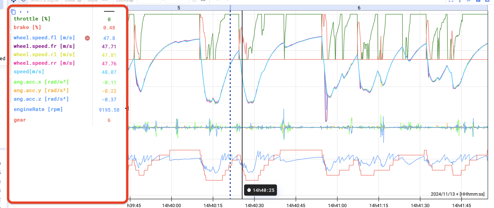
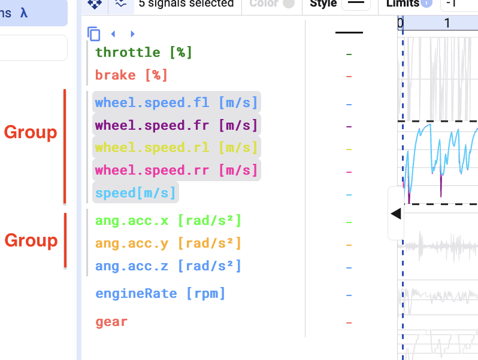

The Time Series plot is the standard plot type and the most versatile: visualize multiple signals in one plot to see how they correlate. Select as many signals as you like — see [Signal List](/deepview/analysis/signal-list).

## Plot signals

Once signals are added to a Time Series plot, they appear in a panel on the left of the plot. Each signal gets a default color and is grouped together with signals sharing the same limits or y-axis.

## Selecting signals

Clicking a signal that's part of a signal group selects the whole group — you'll see the background of the grouped signals turn grey with a continuous line next to them. Click the signal again to change the settings of just that individual signal.

