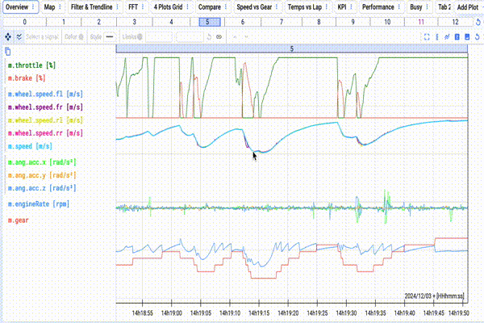
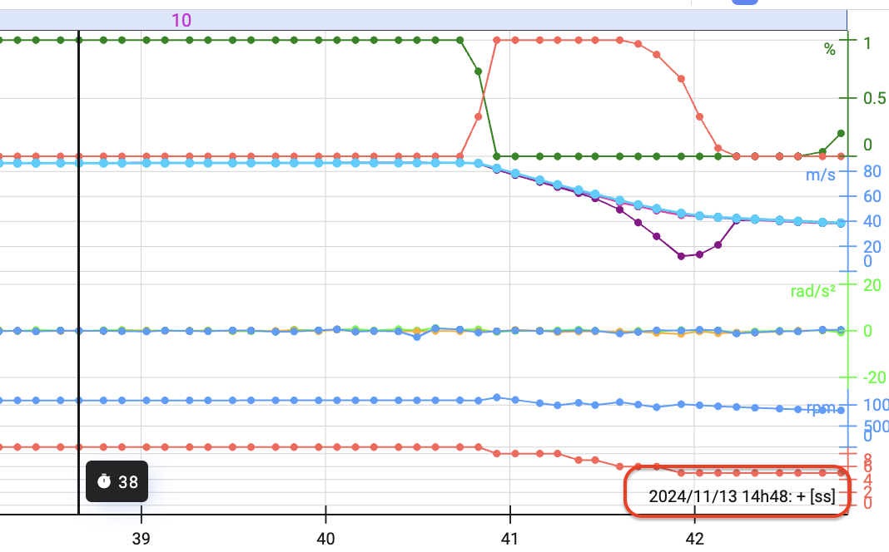
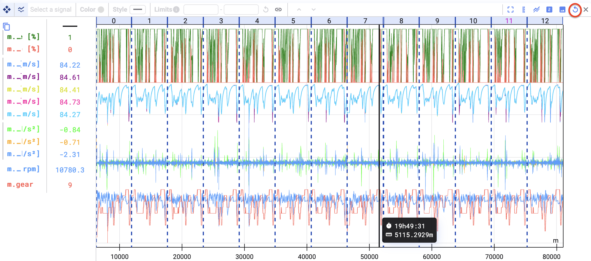

When you zoom in on your plot, you select the limits of the x-axis, or time axis.

To zoom in and out, either scroll with your mouse or use your right mouse button and select the part of the plot you want to zoom into.

You'll see the time values on the x-axis adapt, and possibly even change unit. Lost in time after zooming? In the bottom-right of the Time Series plot, you'll always see the context of the unit.

To reset zooming, click the reset zoom button at the top-right of the Time Series plot.

{/* UNMATCHED extra screenshot found on live page, no marker to replace */}

