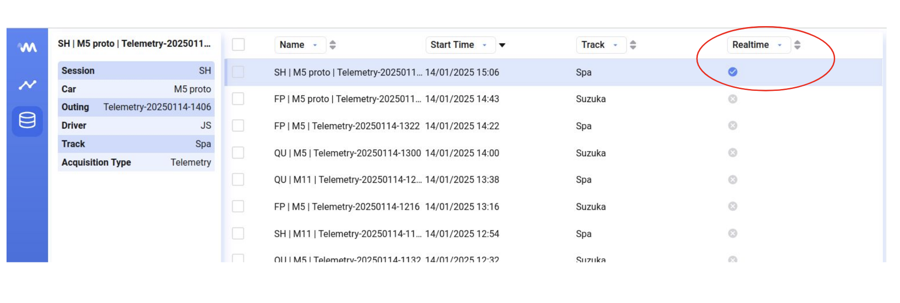
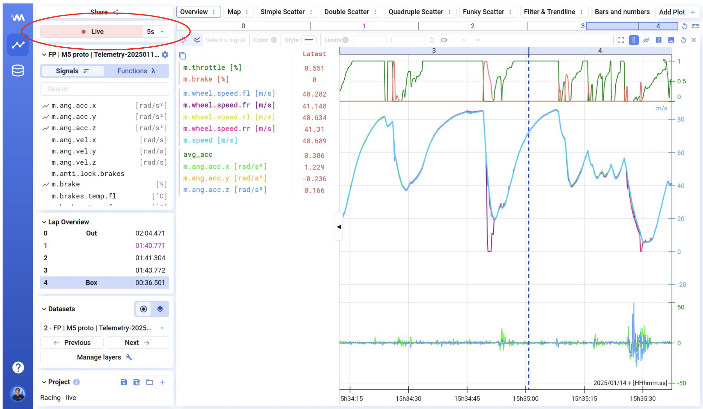
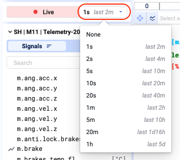
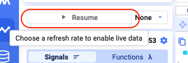

Deepview supports visualizing realtime data.

If a data set is realtime, the realtime metadata field is `True`, and a blue checkmark shows in the data library.

## Live mode

If you select a realtime data set to visualize, the time axis updates automatically and new data appears. A **Live** banner shows at the top-left of the screen to indicate the data is live.

## Refresh rate

By default, the refresh rate is 1s. To change it, click the dropdown next to the Live banner and set the desired refresh rate.

Next to the refresh rate, you'll see in grey the maximum view of data you can visualize at the chosen refresh rate.

## Disable live mode

To disable the live view of realtime data, set the refresh rate to `None`. The Live banner then shows the *Resume* status.

You can now analyze the data from the realtime data set like any other data set. Resume live mode by selecting a refresh rate other than `None`.

Easily toggling live mode on and off, and treating realtime data like any other data set, is very powerful.
