To go to the database, click the Database icon in the left navigation bar.

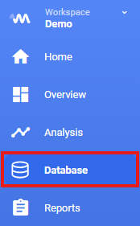

## Folder structure

Deepview offers a flexible folder structure that you can configure to organize your data sets using metadata fields.

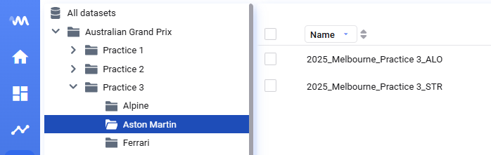

Navigate to **Settings → Connection → Metadata → Library folder structure** to set it up.

- Choose one or more metadata fields to create multiple folder levels
- Optionally split a metadata field's value by a specific character to generate sub-levels

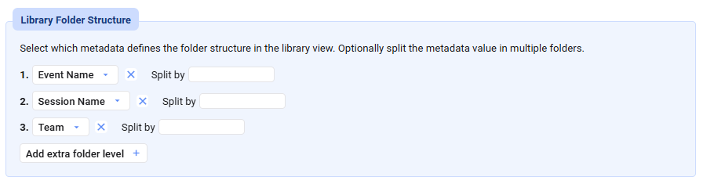

If you want your Deepview folder structure to reflect a `Folder` metadata field, select `Folder` as the folder level and set `/` as the split character.

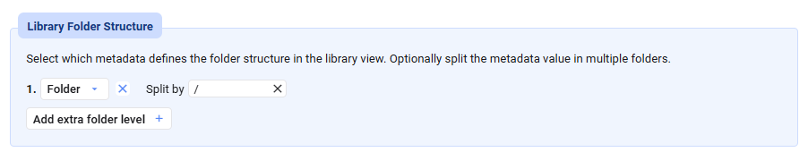

## Changing columns and sorting

In the data library, you'll see a list of all data sets identified in your database.

You can change which columns are visible in the data set list by clicking a column title.

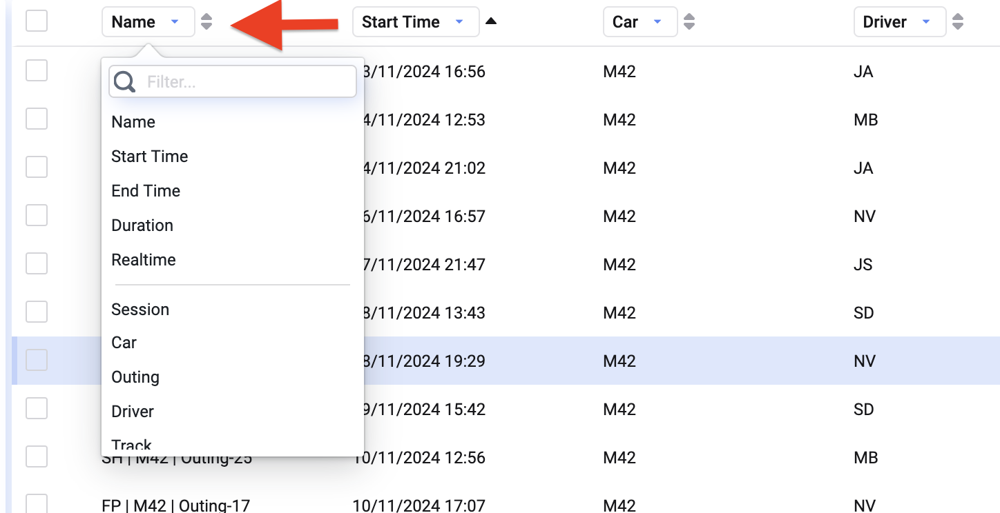

Click the arrows next to a column title to change the sorting of the data sets.

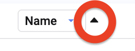

## Filtering and searching data sets

Another useful way to search through your data sets is the search bar to the left of the data list.

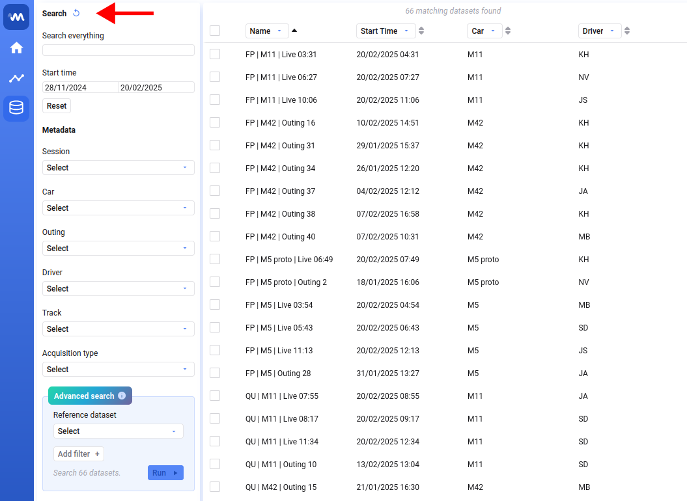

There are multiple ways to search for data sets:

- Start typing to filter data sets on that text
- Specify a time range — only data sets whose start time falls in this range are shown
- Select specific values for any of the metadata fields

### Advanced search

Advanced search finds all data sets where signal values match one or more specified conditions.

To create an advanced search query, first select a reference data set — this tells Deepview which signal names are available. Once selected, you can start adding filters. Each filter consists of:

- **Signal** — any signal present in the reference data set, any function defined in the workspace, or a signal name you type yourself if it isn't part of the reference data set
- **Operator** — `>`, `>=`, `<`, `<=`, `==`, and `≠` are available
- **Value** — currently only numeric values are supported

You can add multiple filters — only data sets that comply with all filters are returned. Advanced search looks for data sets that comply with each filter individually at some point in the data set, not necessarily all at the same point in time.

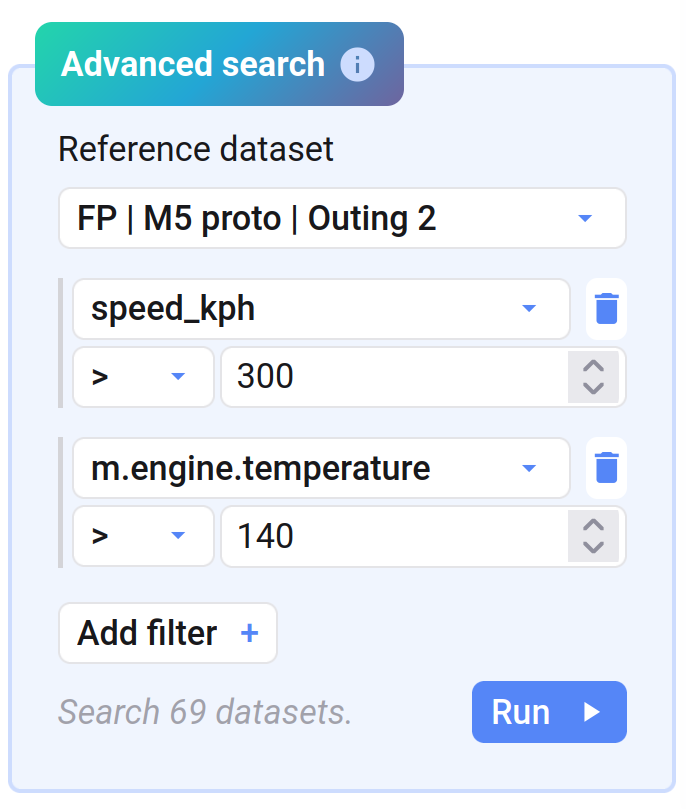

Click **Run** to start the advanced search. This might take some time, as it's a complex operation on a potentially huge set of data.

Advanced search is applied to all data sets matching your other search criteria (time range and metadata selection). When those settings change, or you specify different filter values, your advanced search results become outdated and Deepview reminds you to rerun your advanced search criteria.

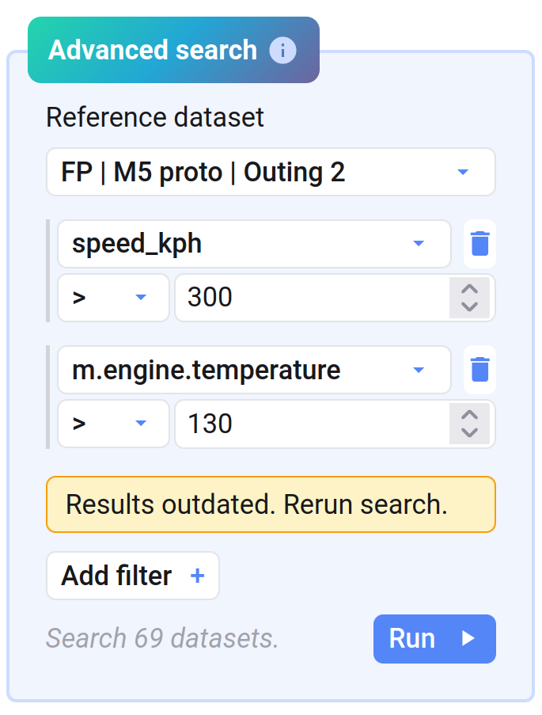

To clear all filters in the search bar, click the circular arrow next to the search title.

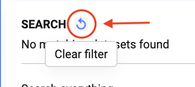

## Selecting data

Selecting data is easy — click the checkbox next to a data set.

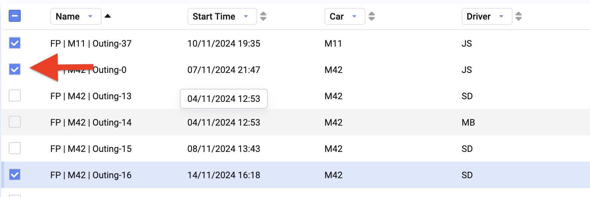

To select all data in your data list, click the checkbox at the top of the data set list.

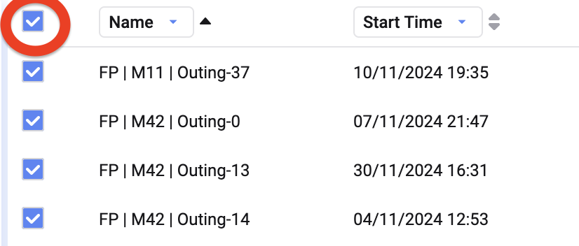

Selected data sets appear at the bottom-right of your screen, under **Selected datasets**.

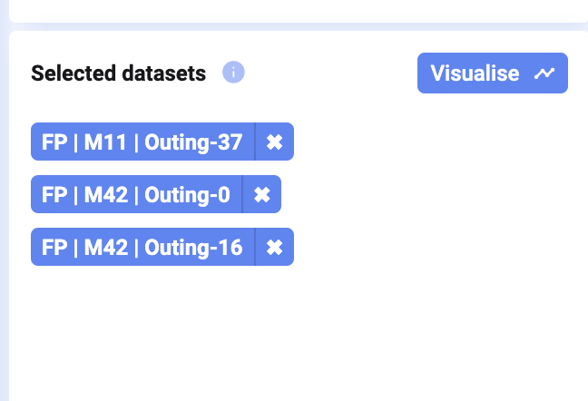

After selecting your data, click **Visualise** to dive into your data.

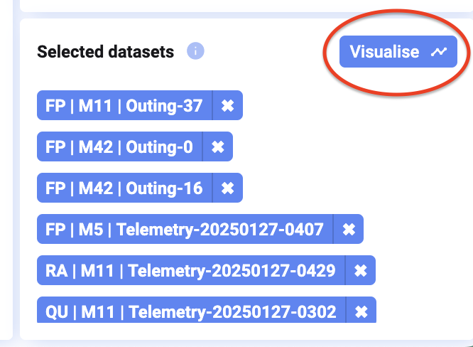

## Already visualized data

If data is already visualized in the currently open project, a graph icon appears next to the data set.

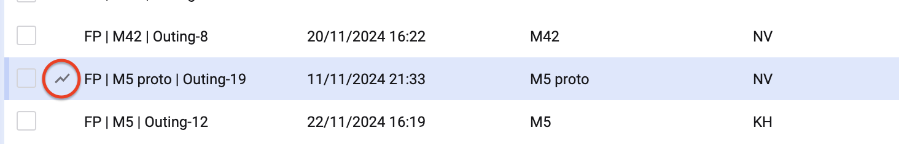

## Signal metadata

Click a data set, and the panel on the right of your screen shows an overview of all the available information about it — this is also called **metadata**.

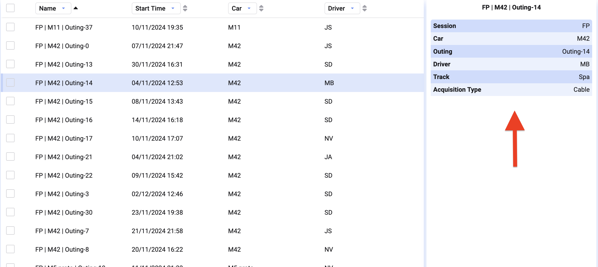

If you want to show this metadata for your entire data list, you can change which columns are shown (see [Changing columns and sorting](#changing-columns-and-sorting) above). This also lets you sort on this data.

## Configure metadata

As an admin, in the Settings view, you can configure:

- Which data columns should be considered metadata
- How these metadata columns should be displayed
- Which metadata should be shown by default in the library view, and in what order

Here you can also change which fields are considered when defining data sets, effectively changing which data sets appear in the data library.

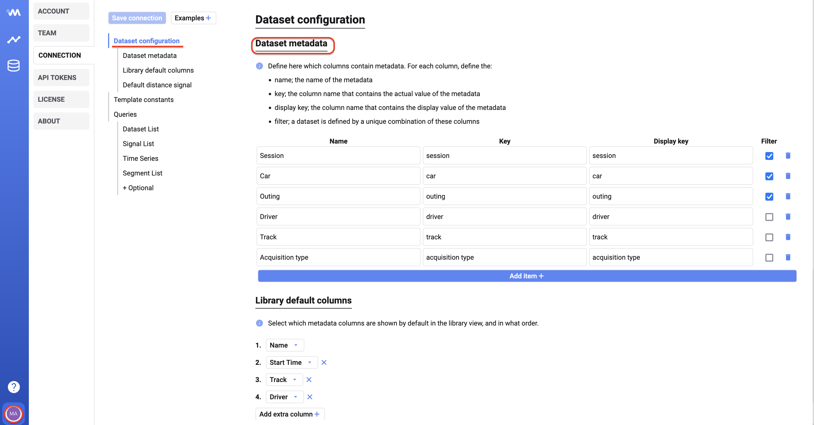

## Empty library

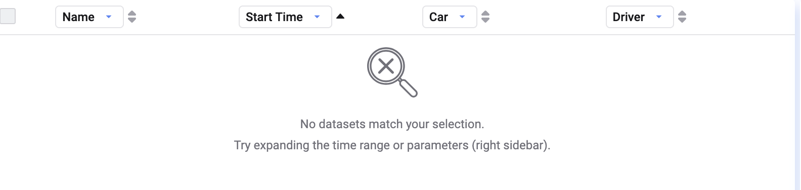

If the library is empty, your data connection likely hasn't started delivering data yet, or isn't provisioned — contact your Invisyne administrator.

It could also mean a filter is applied and no data sets match your selection. In that case, reset your filter by clicking **Clear Filter** next to the search filter in the left toolbar.

{/* UNMATCHED extra screenshot found on live page, no marker to replace */}

